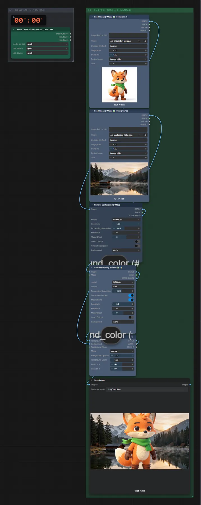

# Freigestelltes Objekt einsetzen

**Workflow-Datei:** [`workflows/Image Utilities/Image-Combiner-Transparent-Items.json`](../../../workflows/Image%20Utilities/Image-Combiner-Transparent-Items.json)  
**Kategorie:** Image Utilities · **Eingabe → Ausgabe:** Bild → Bild

Objekt mit RMBG freistellen und in ein anderes Bild einsetzen.

Interaktiv mit Zoom, Vergleichen und Kopier-Buttons: <https://dawasteh.github.io/DaWastehs-ComfyUI-Bundle/#/w/image-combiner-transparent-items>

## Workflow in ComfyUI

Screenshot nach dem Hauptbeispiel (Eingaben und Ergebnis im Workflow, Erklärungstafeln ausgeblendet):

## Beispiele

### Freigestelltes Objekt einsetzen

| Einstellung | Wert |
|---|---|
| Dauer (Ausführung) | 15 s |
| VRAM R9700 (belegt / PyTorch-Spitze) | 19,3 GiB / 12,8 GiB |
| RAM (ComfyUI-Prozess) | 27,8 GiB |

Eingabe · ex_landscape_lake.png:  ([Datei](input_ex_landscape_lake.webp))  
Eingabe · ex_character_fox.png:  ([Datei](input_ex_character_fox.webp))  
Ausgabe · Ausgabe:  · [Volle Auflösung (1344×768, WebP mit Workflow – per Drag & Drop in ComfyUI ladbar)](fox.webp)
