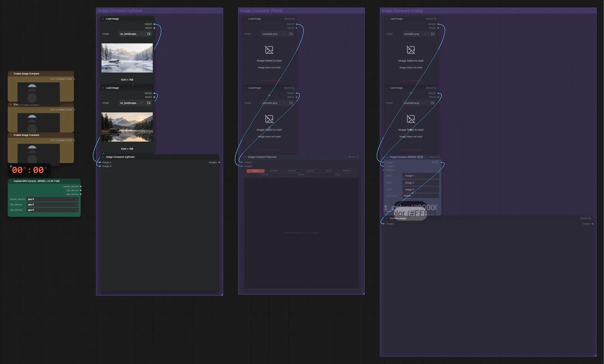

# Bilder vergleichen

**Workflow-Datei:** [`workflows/Image Utilities/Image-Compare.json`](../../../workflows/Image%20Utilities/Image-Compare.json)  
**Kategorie:** Image Utilities · **Eingabe → Ausgabe:** Bild → Vergleich

Zwei Bilder mit Schieberegler vergleichen (rgthree Image Comparer).

Interaktiv mit Zoom, Vergleichen und Kopier-Buttons: <https://dawasteh.github.io/DaWastehs-ComfyUI-Bundle/#/w/image-compare>

## Workflow in ComfyUI

Screenshot nach dem Hauptbeispiel (Eingaben und Ergebnis im Workflow, Erklärungstafeln ausgeblendet):

## Beispiele

### Zwei Bilder vergleichen

| Einstellung | Wert |
|---|---|
| Dauer (Ausführung) | 0 s |
| VRAM R9700 (belegt / PyTorch-Spitze) | 12,8 GiB / 0,1 GiB |
| RAM (ComfyUI-Prozess) | 1,0 GiB |

Eingabe · ex_landscape_lake.png:  ([Datei](input_ex_landscape_lake.webp))  
Eingabe · ex_landscape_lake_winter.png:  ([Datei](input_ex_landscape_lake_winter.webp))  
Ausgabe · Bild 1:  · [Volle Auflösung (1344×768, WebP mit Workflow – per Drag & Drop in ComfyUI ladbar)](winter__n21-1.webp)  
Ausgabe · Bild 2: 
