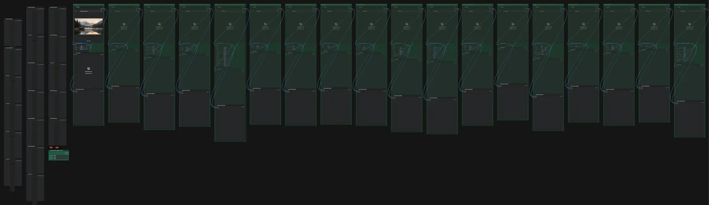

# Filter-Katalog

**Workflow-Datei:** [`workflows/Image Utilities/Image-Filters-Catalog.json`](../../../workflows/Image%20Utilities/Image-Filters-Catalog.json)  
**Kategorie:** Image Utilities · **Eingabe → Ausgabe:** Bild → Bild

Viele Bildfilter zum Durchprobieren; einzelne Gruppen per Strg+M einschalten.

Interaktiv mit Zoom, Vergleichen und Kopier-Buttons: <https://dawasteh.github.io/DaWastehs-ComfyUI-Bundle/#/w/image-filters-catalog>

## Workflow in ComfyUI

Screenshot nach dem Hauptbeispiel (Eingaben und Ergebnis im Workflow, Erklärungstafeln ausgeblendet):

## Beispiele

### Filterkatalog

| Einstellung | Wert |
|---|---|
| Dauer (Ausführung) | 0 s |
| VRAM R9700 (belegt / PyTorch-Spitze) | 12,8 GiB / 0,1 GiB |
| RAM (ComfyUI-Prozess) | 1,1 GiB |

Eingabe · ex_landscape_lake.png:  ([Datei](input_ex_landscape_lake.webp))  
Ausgabe · Bild 1:  · [Volle Auflösung (1344×768, WebP mit Workflow – per Drag & Drop in ComfyUI ladbar)](lake__n37-1.webp)  
Ausgabe · Bild 2:   
Ausgabe · Bild 3: 
