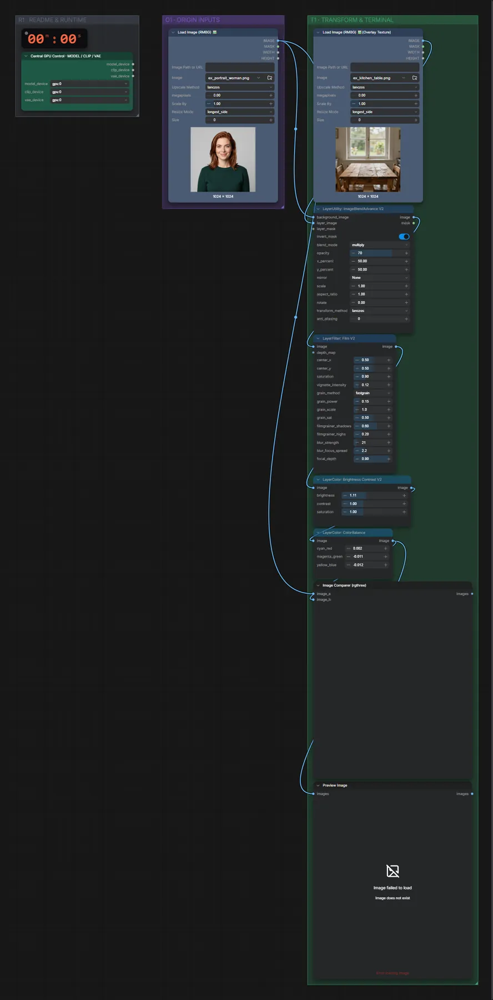

# Filter + Overlay

**Workflow-Datei:** [`workflows/Image Utilities/Image-Filters-Example.json`](../../../workflows/Image%20Utilities/Image-Filters-Example.json)  
**Kategorie:** Image Utilities · **Eingabe → Ausgabe:** Bild → Bild

Filterkette mit Überlagerungs-Textur.

Interaktiv mit Zoom, Vergleichen und Kopier-Buttons: <https://dawasteh.github.io/DaWastehs-ComfyUI-Bundle/#/w/image-filters-example>

## Workflow in ComfyUI

Screenshot nach dem Hauptbeispiel (Eingaben und Ergebnis im Workflow, Erklärungstafeln ausgeblendet):

## Beispiele

### Filter + Overlay-Textur

| Einstellung | Wert |
|---|---|
| Dauer (Ausführung) | 1 s |
| VRAM R9700 (belegt / PyTorch-Spitze) | 12,8 GiB / 0,1 GiB |
| RAM (ComfyUI-Prozess) | 1,4 GiB |

Eingabe · ex_portrait_woman.png:  ([Datei](input_ex_portrait_woman.webp))  
Eingabe · ex_kitchen_table.png:  ([Datei](input_ex_kitchen_table.webp))  
Ausgabe · Bild 1:  · [Volle Auflösung (1024×1024, WebP mit Workflow – per Drag & Drop in ComfyUI ladbar)](portrait__n5.webp)  
Ausgabe · Bild 2:   
Ausgabe · Bild 3: 
