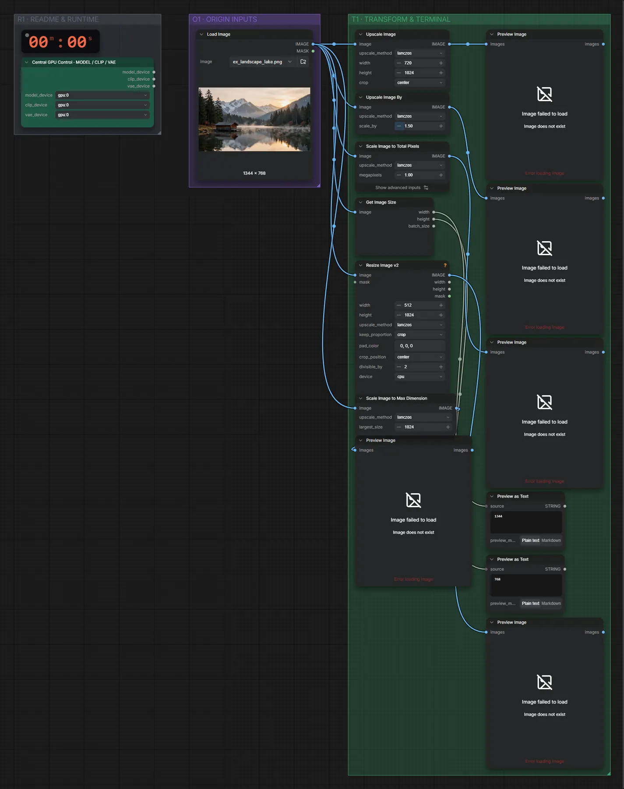

# Bild skalieren

**Workflow-Datei:** [`workflows/Image Utilities/Image-Scale.json`](../../../workflows/Image%20Utilities/Image-Scale.json)  
**Kategorie:** Image Utilities · **Eingabe → Ausgabe:** Bild → Bilder

Vier Arten zu skalieren (feste Größe, Faktor, Megapixel, KJ-Resize) im Vergleich.

Interaktiv mit Zoom, Vergleichen und Kopier-Buttons: <https://dawasteh.github.io/DaWastehs-ComfyUI-Bundle/#/w/image-scale>

## Workflow in ComfyUI

Screenshot nach dem Hauptbeispiel (Eingaben und Ergebnis im Workflow, Erklärungstafeln ausgeblendet):

[](workflow.webp)

## Beispiele

### Skalieren (vier Methoden)

| Einstellung | Wert |
|---|---|
| Dauer (Ausführung) | 0 s |
| VRAM R9700 (belegt / PyTorch-Spitze) | 12,8 GiB / 0,1 GiB |
| RAM (ComfyUI-Prozess) | 1,1 GiB |

Eingabe · ex_landscape_lake.png:  ([Datei](input_ex_landscape_lake.webp))  
Ausgabe · Bild 1: [](lake__n7.webp) · [Volle Auflösung (2016×1152, WebP mit Workflow – per Drag & Drop in ComfyUI ladbar)](lake__n7.webp)  
Ausgabe · Bild 2: [](lake__n10.webp)  
Ausgabe · Bild 3: [](lake__n5.webp)  
Ausgabe · Bild 4: [](lake__n3.webp)  
Ausgabe · Bild 5: [](lake__n24.webp)  

PreviewAny:

```text
768
```

PreviewAny:

```text
1344
```
