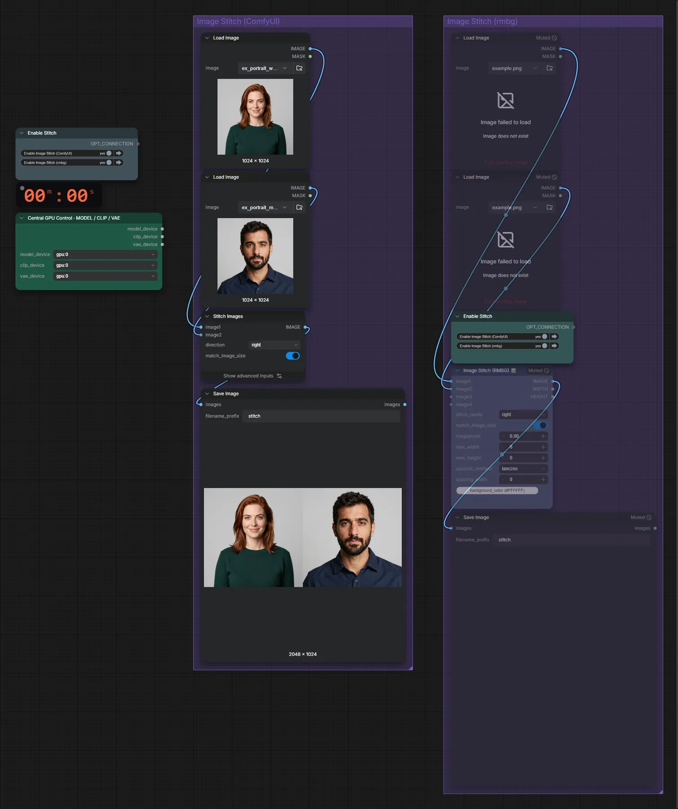

# Bilder aneinanderfügen

**Workflow-Datei:** [`workflows/Image Utilities/Image-Stitch.json`](../../../workflows/Image%20Utilities/Image-Stitch.json)  
**Kategorie:** Image Utilities · **Eingabe → Ausgabe:** Bild → Bild

Zwei Bilder neben- oder untereinander setzen.

Interaktiv mit Zoom, Vergleichen und Kopier-Buttons: <https://dawasteh.github.io/DaWastehs-ComfyUI-Bundle/#/w/image-stitch>

## Workflow in ComfyUI

Screenshot nach dem Hauptbeispiel (Eingaben und Ergebnis im Workflow, Erklärungstafeln ausgeblendet):

## Beispiele

### Zwei Bilder zusammensetzen

| Einstellung | Wert |
|---|---|
| Dauer (Ausführung) | 0 s |
| VRAM R9700 (belegt / PyTorch-Spitze) | 6,2 GiB / 0,1 GiB |
| RAM (ComfyUI-Prozess) | 0,9 GiB |

Eingabe · ex_portrait_woman.png:  ([Datei](input_ex_portrait_woman.webp))  
Eingabe · ex_portrait_man.png:  ([Datei](input_ex_portrait_man.webp))  
Ausgabe · Ausgabe:  · [Volle Auflösung (2048×1024, WebP mit Workflow – per Drag & Drop in ComfyUI ladbar)](portraits.webp)
