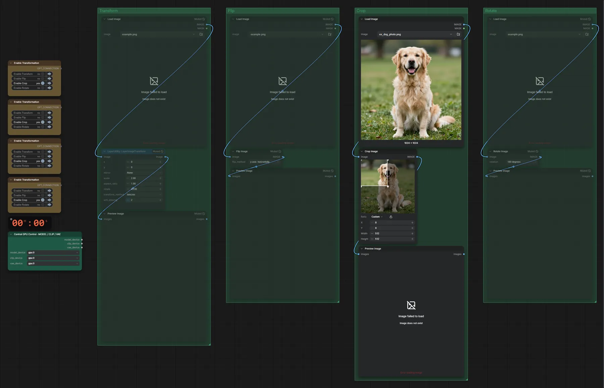

# Bild transformieren

**Workflow-Datei:** [`workflows/Image Utilities/Image-Transformation.json`](../../../workflows/Image%20Utilities/Image-Transformation.json)  
**Kategorie:** Image Utilities · **Eingabe → Ausgabe:** Bild → Bild

Drehen, spiegeln, zuschneiden.

Interaktiv mit Zoom, Vergleichen und Kopier-Buttons: <https://dawasteh.github.io/DaWastehs-ComfyUI-Bundle/#/w/image-transformation>

## Workflow in ComfyUI

Screenshot nach dem Hauptbeispiel (Eingaben und Ergebnis im Workflow, Erklärungstafeln ausgeblendet):

## Beispiele

### Drehen/Spiegeln/Zuschneiden

| Einstellung | Wert |
|---|---|
| Dauer (Ausführung) | 0 s |
| VRAM R9700 (belegt / PyTorch-Spitze) | 12,8 GiB / 0,1 GiB |
| RAM (ComfyUI-Prozess) | 1,0 GiB |

Eingabe · ex_dog_photo.png:  ([Datei](input_ex_dog_photo.webp))  
Ausgabe · Bild 1:  · [Volle Auflösung (512×512, WebP)](dog__n12.webp)  
Ausgabe · Bild 2: 
