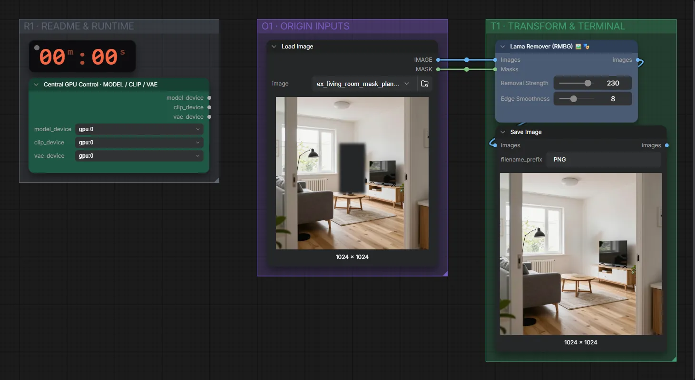
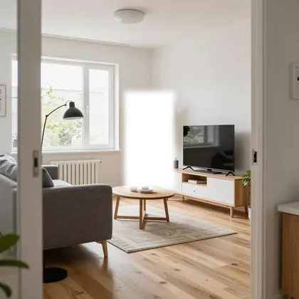
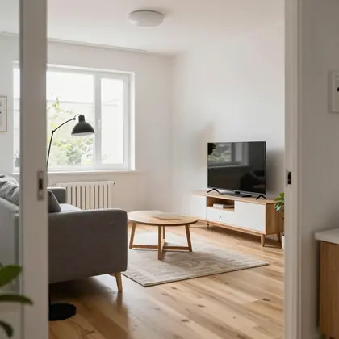

# LaMa · Objekt entfernen

**Workflow-Datei:** [`workflows/Image Utilities/LaMa-Image+Mask-Object-Remover.json`](../../../workflows/Image%20Utilities/LaMa-Image%2BMask-Object-Remover.json)  
**Kategorie:** Image Utilities · **Eingabe → Ausgabe:** Bild + Maske → Bild

Bis v1.3.0 hieß der Workflow `Lama-Object-Remover.json`.

Maskiertes Objekt mit LaMa entfernen und den Hintergrund ergänzen (ohne Diffusion, sehr schnell).

Interaktiv mit Zoom, Vergleichen und Kopier-Buttons: <https://dawasteh.github.io/DaWastehs-ComfyUI-Bundle/#/w/lama-image-mask-object-remover>

## Workflow in ComfyUI

Screenshot nach dem Hauptbeispiel (Eingaben und Ergebnis im Workflow, Erklärungstafeln ausgeblendet):

## Beispiele

### Objekt entfernen (LaMa)

| Einstellung | Wert |
|---|---|
| Dauer (Ausführung) | 1 min 2 s |
| VRAM R9700 (belegt / PyTorch-Spitze) | 17,6 GiB / 12,8 GiB |
| RAM (ComfyUI-Prozess) | 2,0 GiB |

Eingabe · ex_living_room_mask_plant.png:  ([Datei](input_ex_living_room_mask_plant.webp))  
Ausgabe · Ausgabe:  · [Volle Auflösung (1024×1024, WebP mit Workflow – per Drag & Drop in ComfyUI ladbar)](plant.webp)
