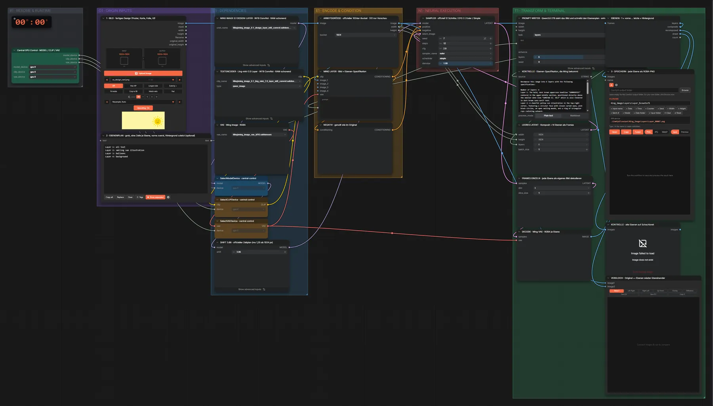
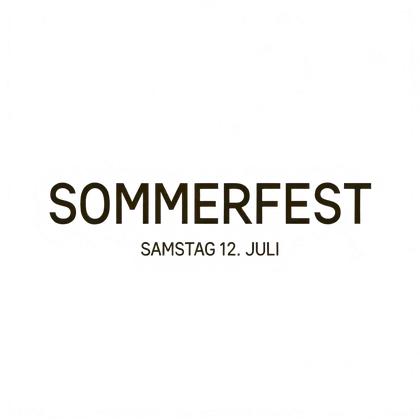
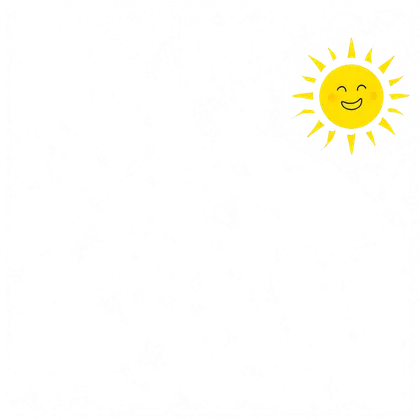
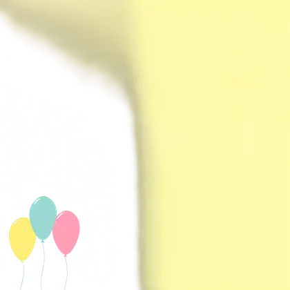

# Ming Image 0.1 Design-Layer · Design → Ebenen

**Workflow-Datei:** [`workflows/Image Utilities/Ming_Image_0_1_Design_Layer_INT8-Image-to-Layers.json`](../../../workflows/Image%20Utilities/Ming_Image_0_1_Design_Layer_INT8-Image-to-Layers.json)  
**Kategorie:** Image Utilities · **Eingabe → Ausgabe:** Bild → Ebenen (RGBA) · **Quant:** INT8

Bis v1.3.0 hieß der Workflow `Ming_Image_0_1_Design_Layer_INT8-Layer-Decompose.json`.

Ein fertiges Design wird in RGBA-Ebenen zerlegt (Text, Illustrationen, Hintergrund); der Qwen3.8-Writer erstellt den Ebenenplan.

Interaktiv mit Zoom, Vergleichen und Kopier-Buttons: <https://dawasteh.github.io/DaWastehs-ComfyUI-Bundle/#/w/ming-image-0-1-design-layer-int8-image-to-layers>

## Modelle

| Rolle | Datei | Quant | Größe |
|---|---|---|---:|
| Diffusionsmodell | `ming_image_0.1_design_layer_int8_convrot.safetensors` | INT8 | 5,8 GiB |
| Text-Encoder | `ming_image_0.1_ling_mini_2.0_layer_int8_convrot.safetensors` | INT8 | 18,2 GiB |
| VAE | `ming_image_vae_bf16.safetensors` | BF16 | 0,2 GiB |

## Workflow in ComfyUI

Screenshot nach dem Hauptbeispiel (Eingaben und Ergebnis im Workflow, Erklärungstafeln ausgeblendet):

[](workflow.webp)

## Beispiele

### Design in Ebenen zerlegen

Prompt:

```text
Layer 1: all text
Layer 2: smiling sun illustration
Layer 3: balloons
Layer 4: background
```

| Einstellung | Wert |
|---|---|
| seed | 7 |
| shift | 3.86 |
| steps | 12 |
| cfg | 2.0 |
| sampler_name | euler |
| scheduler | simple |
| denoise | 1.0 |
| Dauer (Ausführung) | 4 min 7 s |
| VRAM R9700 (belegt / PyTorch-Spitze) | 23,2 GiB / 21,5 GiB |
| RAM (ComfyUI-Prozess) | 32,0 GiB |

Eingabe · ex_design_card.png:  ([Datei](input_ex_design_card.webp))  
Ausgabe · 3 · SPEICHERN · jede Ebene als RGBA-PNG: [](card__n17-1.webp) · [Volle Auflösung (1024×1024, WebP mit Workflow – per Drag & Drop in ComfyUI ladbar)](card__n17-1.webp)  
Ausgabe · 3 · SPEICHERN · jede Ebene als RGBA-PNG: [](card__n17-2.webp)  
Ausgabe · 3 · SPEICHERN · jede Ebene als RGBA-PNG: [](card__n17-3.webp)  
Ausgabe · 3 · SPEICHERN · jede Ebene als RGBA-PNG: [](card__n17-4.webp)  

KONTROLLE · Ebenen-Spezifikation, die Ming bekommt:

```text
Decompose this image into 6 layers with the following specifications:

Number of layers: 6
Layer 1: The bold, dark brown uppercase headline "SOMMERFEST" centered in the upper-middle section, positioned directly above the smaller date line "SAMSTAG 12. JULI" which is also rendered in dark brown sans-serif text.
Layer 2: A cheerful yellow sun illustration in the top-right corner, featuring a circular face with closed curved eyes, pink blush circles, an open smiling mouth, and a ring of triangular rays radiating outward.
Layer 3: A cluster of three floating balloons anchored in the bottom-left corner, consisting of a light yellow balloon on the left, a teal-blue balloon in the center, and a pink balloon on the right, each with a subtle white highlight and a thin trailing string.
Layer 4: The flat background layer featuring a soft vertical gradient that transitions from pale cream-white at the top to a slightly warmer light yellow at the bottom, providing a clean canvas for the foreground elements.
Layer 5: Subtle decorative accents including faint diagonal lines radiating from the sun's position and a small horizontal dash mark located in the lower-right area.
Layer 6: The base environment layer encompassing the overall spatial context and any underlying surface tones that support the composition without distinct visual separation.
```
