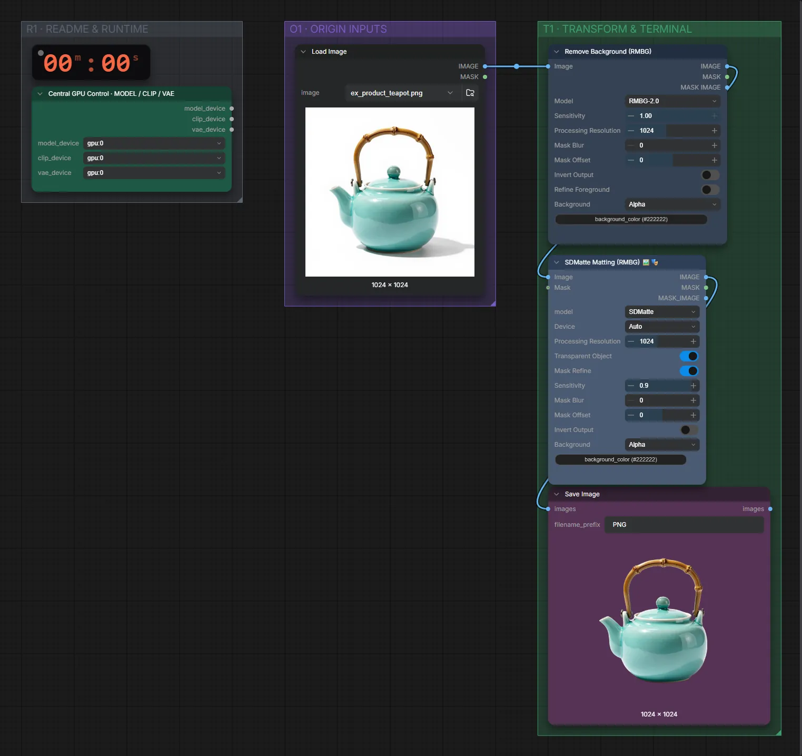

# Freisteller für Objekte

**Workflow-Datei:** [`workflows/Image Utilities/RMBG-Image-to-Transparent-Items.json`](../../../workflows/Image%20Utilities/RMBG-Image-to-Transparent-Items.json)  
**Kategorie:** Image Utilities · **Eingabe → Ausgabe:** Bild → Bild (RGBA)

Bis v1.3.0 hieß der Workflow `Remove-Background-Transparent-Items.json`.

Freistellen für Produkte und Objekte (transparente PNGs).

Interaktiv mit Zoom, Vergleichen und Kopier-Buttons: <https://dawasteh.github.io/DaWastehs-ComfyUI-Bundle/#/w/rmbg-image-to-transparent-items>

## Workflow in ComfyUI

Screenshot nach dem Hauptbeispiel (Eingaben und Ergebnis im Workflow, Erklärungstafeln ausgeblendet):

## Beispiele

### Freisteller für Objekte

| Einstellung | Wert |
|---|---|
| Dauer (Ausführung) | 12 s |
| VRAM R9700 (belegt / PyTorch-Spitze) | 17,7 GiB / 12,8 GiB |
| RAM (ComfyUI-Prozess) | 9,3 GiB |

Eingabe · ex_product_teapot.png:  ([Datei](input_ex_product_teapot.webp))  
Ausgabe · Ausgabe:  · [Volle Auflösung (1024×1024, WebP mit Workflow – per Drag & Drop in ComfyUI ladbar)](teapot.webp)
