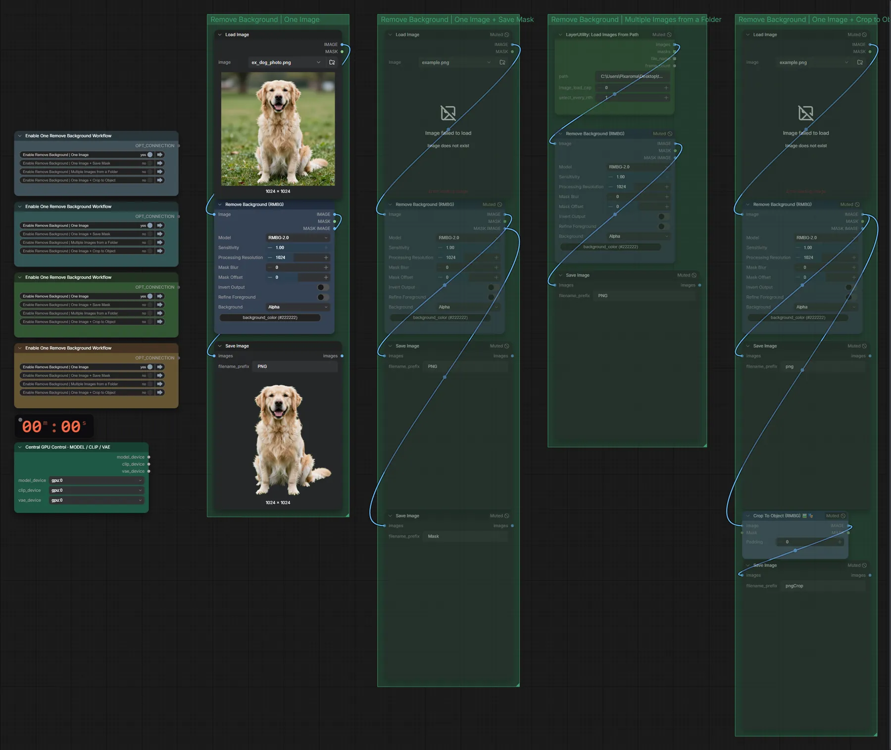

# RMBG-2.0 · Hintergrund entfernen

**Workflow-Datei:** [`workflows/Image Utilities/RMBG-Image-to-Transparent-PNG.json`](../../../workflows/Image%20Utilities/RMBG-Image-to-Transparent-PNG.json)  
**Kategorie:** Image Utilities · **Eingabe → Ausgabe:** Bild → Bild (RGBA)

Bis v1.3.0 hieß der Workflow `Remove-Background-RMBG.json`.

Schnelles Freistellen mit RMBG-2.0 als PNG mit Alphakanal.

Interaktiv mit Zoom, Vergleichen und Kopier-Buttons: <https://dawasteh.github.io/DaWastehs-ComfyUI-Bundle/#/w/rmbg-image-to-transparent-png>

## Workflow in ComfyUI

Screenshot nach dem Hauptbeispiel (Eingaben und Ergebnis im Workflow, Erklärungstafeln ausgeblendet):

## Beispiele

### Hintergrund entfernen (RMBG-2.0)

| Einstellung | Wert |
|---|---|
| Dauer (Ausführung) | 3 s |
| VRAM R9700 (belegt / PyTorch-Spitze) | 7,2 GiB / 4,8 GiB |
| RAM (ComfyUI-Prozess) | 3,5 GiB |

Eingabe · ex_dog_photo.png:  ([Datei](input_ex_dog_photo.webp))  
Ausgabe · Ausgabe:  · [Volle Auflösung (1024×1024, WebP mit Workflow – per Drag & Drop in ComfyUI ladbar)](dog.webp)
