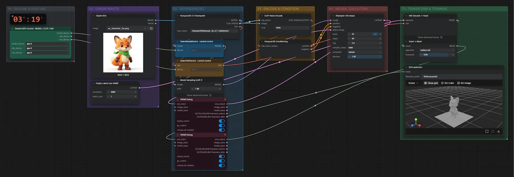

# Hunyuan3D 2.1 (FP16) · Bild → 3D-Mesh

**Workflow-Datei:** [`workflows/Image to 3D-Mesh/Hunyuan3D_2_1_FP16-Image-to-Mesh.json`](../../../workflows/Image%20to%203D-Mesh/Hunyuan3D_2_1_FP16-Image-to-Mesh.json)  
**Kategorie:** Image to 3D-Mesh · **Eingabe → Ausgabe:** Bild → 3D-Modell · **Quant:** FP16

Bis v1.3.0 hieß der Workflow `Hunyuan3D_v2_1-Image-to-3D-Mesh.json`.

Ein freigestelltes Objekt oder eine Figur wird zum Mesh (GLB, untexturiert).

Interaktiv mit Zoom, Vergleichen und Kopier-Buttons: <https://dawasteh.github.io/DaWastehs-ComfyUI-Bundle/#/w/hunyuan3d-2-1-fp16-image-to-mesh>

## Modelle

| Rolle | Datei | Quant | Größe |
|---|---|---|---:|
| Modell | `hunyuan_3d_v2.1.safetensors` | FP16 | 6,9 GiB |

## Workflow in ComfyUI

Screenshot nach dem Hauptbeispiel (Eingaben und Ergebnis im Workflow, Erklärungstafeln ausgeblendet):

## Beispiele

### Figur → 3D-Mesh

| Einstellung | Wert |
|---|---|
| seed | 42 |
| shift | 1 |
| steps | 40 |
| cfg | 5 |
| sampler_name | euler |
| scheduler | normal |
| denoise | 1 |
| Dauer (Ausführung) | 58 s |
| VRAM R9700 (belegt / PyTorch-Spitze) | 10,3 GiB / 7,1 GiB |
| RAM (ComfyUI-Prozess) | 12,9 GiB |

Eingabe · ex_character_fox.png:  ([Datei](input_ex_character_fox.webp))  
Ausgabe · GLB speichern: [fox.glb](fox.glb)
