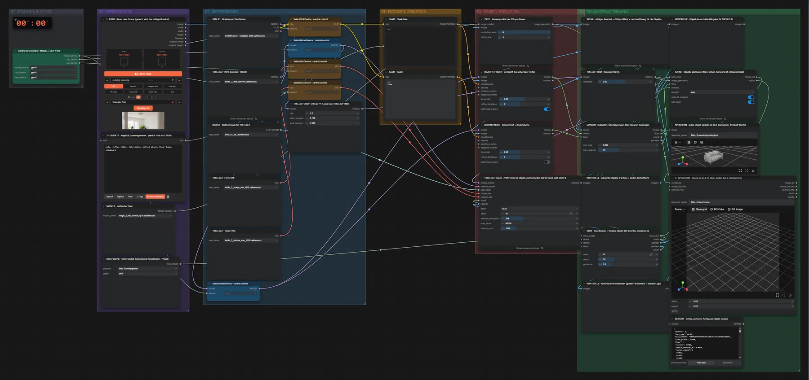

# Mira-Scene + TRELLIS.2 (INT8) · Foto → 3D-Szene

**Workflow-Datei:** [`workflows/Image to 3D-Mesh/Mira_Scene+TRELLIS2_INT8-Image-to-3D-Scene.json`](../../../workflows/Image%20to%203D-Mesh/Mira_Scene%2BTRELLIS2_INT8-Image-to-3D-Scene.json)  
**Kategorie:** Image to 3D-Mesh · **Eingabe → Ausgabe:** Bild + Text → 3D-Szene · **Quant:** INT8

Bis v1.3.0 hieß der Workflow `Mira_Scene-Image-to-3D-Scene.json`.

SAM 3.1 findet die genannten Objekte, MoGe-2 schätzt die Tiefe, Mira platziert je Objekt ein TRELLIS.2-Mesh mit PBR-Textur – Ergebnis ist eine bearbeitbare GLB-Szene.

Interaktiv mit Zoom, Vergleichen und Kopier-Buttons: <https://dawasteh.github.io/DaWastehs-ComfyUI-Bundle/#/w/mira-scene-trellis2-int8-image-to-3d-scene>

## Modelle

| Rolle | Datei | Quant | Größe |
|---|---|---|---:|
| Modell | `sam3.1_multiplex_fp16.safetensors` | FP16 | 1,6 GiB |
| Tiefenschätzung | `moge_2_vitl_normal_fp16.safetensors` | FP16 | 0,6 GiB |
| Diffusionsmodell | `trellis_2_int8_convrot.safetensors` | INT8 | 4,9 GiB |
| Vision-Encoder | `dino_v3_vit_l.safetensors` | FP32 | 1,1 GiB |
| VAE | `trellis_2_shape_vae_bf16.safetensors` | BF16 | 1,0 GiB |
| VAE | `trellis_2_texture_vae_bf16.safetensors` | BF16 | 0,9 GiB |

## Workflow in ComfyUI

Screenshot nach dem Hauptbeispiel (Eingaben und Ergebnis im Workflow, Erklärungstafeln ausgeblendet):

[](workflow.webp)

## Beispiele

### Foto → 3D-Szene (ein Mesh je Objekt)

Prompt:

```text
sofa, coffee table, television, potted plant, floor lamp, sideboard
```

| Einstellung | Wert |
|---|---|
| objects | sofa, coffee table, television, potted plant, floor lamp, sideboard |
| Dauer (Ausführung) | 5 min 39 s |
| VRAM R9700 (belegt / PyTorch-Spitze) | 19,6 GiB / 12,9 GiB |
| RAM (ComfyUI-Prozess) | 12,0 GiB |

Eingabe · ex_living_room.png:  ([Datei](input_ex_living_room.webp))  
Ausgabe · Gesamtszene (alle Objekte, Y oben): [room__n25.glb](room__n25.glb)  
Ausgabe · Objekt 1: [room__n27-1.glb](room__n27-1.glb)  
Ausgabe · Objekt 2: [room__n27-2.glb](room__n27-2.glb)  
Ausgabe · Objekt 3: [room__n27-3.glb](room__n27-3.glb)  
Ausgabe · Objekt 4: [room__n27-4.glb](room__n27-4.glb)  
Ausgabe · Objekt 5: [room__n27-5.glb](room__n27-5.glb)  
Ausgabe · Objekt 6: [room__n27-6.glb](room__n27-6.glb)  

BERICHT · Größe, aufrecht, Auflage je Objekt (Meter):

```text
{
 "objects": 6,
 "fov_x_deg": 44.59,
 "mira_commit": "18f42656f3b6f96ef61d9b291c93d1036bdaa016",
 "floor_pixels": 37689,
 "floor": {
  "inliers": 37681,
  "median_residual_m": 0.0014,
  "normal_camera": [
   0.0023,
   0.9992,
   0.0402
  ]
 },
 "floor_side_m": 6.436,
 "placement": [
  {
   "object": 0,
   "upright": true,
   "tilt_deg": 4.7,
   "scale_m": 2.762,
   "size_m": [
    2.971,
    1.373,
    1.962
   ],
   "bottom_y_m": -0.239,
   "support": null
  },
  {
   "object": 1,
   "upright": true,
   "tilt_deg": 3.9,
   "scale_m": 0.817,
   "size_m": [
    0.82,
    0.335,
    0.82
   ],
   "bottom_y_m": 0.0,
   "support": "floor (applied, floor_contact)"
  },
  {
   "object": 2,
   "upright": true,
   "tilt_deg": 6.9,
   "scale_m": 1.21,
   "size_m": [
    0.682,
    0.882,
    1.086
   ],
   "bottom_y_m": 0.496,
   "support": "object_005 (applied, object_contact)"
  },
  {
   "object": 3,
   "upright": true,
   "tilt_deg": 1.0,
   "scale_m": 1.638,
   "size_m": [
    0.732,
    1.645,
    0.825
   ],
   "bottom_y_m": 0.0,
   "support": "floor (applied, floor_contact)"
  },
  {
   "object": 4,
   "upright": true,
   "tilt_deg": 2.9,
   "scale_m": 0.444,
   "size_m": [
    0.19,
    0.44,
    0.136
   ],
   "bottom_y_m": 0.0,
   "support": "floor (applied, floor_contact)"
  },
  {
   "object": 5,
   "upright": true,
   "tilt_deg": 3.6,
   "scale_m": 1.725,
   "size_m": [
    1.215,
    0.538,
    1.689
   ],
   "bottom_y_m": 0.0,
   "support": "floor (applied, floor_contact)"
  }
 ],
 "aabb_overlaps": 4,
 "camera_to_floor": [
  [
   1.0,
   -0.00229,
   -5e-05,
   -0.13941
  ],
  [
   0.00229,
   0.99919,
   0.04015,
   1.07778
  ],
  [
   -5e-05,
   -0.04015,
   0.99919,
   3.17445
  ],
  [
   0.0,
   0.0,
   0.0,
   1.0
  ]
 ]
}
```
