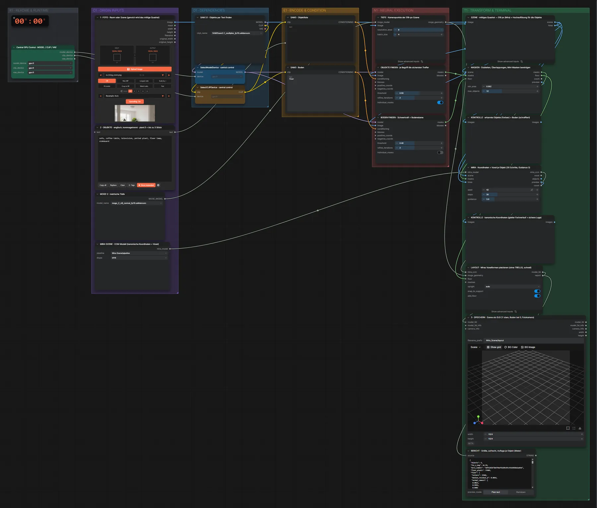

# Mira-Scene · Foto → 3D-Layout (Vorschau)

**Workflow-Datei:** [`workflows/Image to 3D-Mesh/Mira_Scene-Image-to-3D-Layout-Preview.json`](../../../workflows/Image%20to%203D-Mesh/Mira_Scene-Image-to-3D-Layout-Preview.json)  
**Kategorie:** Image to 3D-Mesh · **Eingabe → Ausgabe:** Bild + Text → 3D-Szene

Bis v1.3.0 hieß der Workflow `Mira_Scene-Layout-Preview.json`.

Schnelle Vorschau: Miras Voxelformen statt TRELLIS-Meshes, um Objektliste und Lage zu prüfen.

Interaktiv mit Zoom, Vergleichen und Kopier-Buttons: <https://dawasteh.github.io/DaWastehs-ComfyUI-Bundle/#/w/mira-scene-image-to-3d-layout-preview>

## Modelle

| Rolle | Datei | Quant | Größe |
|---|---|---|---:|
| Modell | `sam3.1_multiplex_fp16.safetensors` | FP16 | 1,6 GiB |
| Tiefenschätzung | `moge_2_vitl_normal_fp16.safetensors` | FP16 | 0,6 GiB |

## Workflow in ComfyUI

Screenshot nach dem Hauptbeispiel (Eingaben und Ergebnis im Workflow, Erklärungstafeln ausgeblendet):

[](workflow.webp)

## Beispiele

### Foto → Layout-Vorschau (Voxel)

Prompt:

```text
sofa, coffee table, television, potted plant, floor lamp, sideboard
```

| Einstellung | Wert |
|---|---|
| objects | sofa, coffee table, television, potted plant, floor lamp, sideboard |
| Dauer (Ausführung) | 1 min 59 s |
| VRAM R9700 (belegt / PyTorch-Spitze) | 12,2 GiB / 7,6 GiB |
| RAM (ComfyUI-Prozess) | 9,2 GiB |

Eingabe · ex_living_room.png:  ([Datei](input_ex_living_room.webp))  
Ausgabe · 3 · SPEICHERN · Szene als GLB (Y oben, Boden bei 0, Fotokamera): [room.glb](room.glb)  

BERICHT · Größe, aufrecht, Auflage je Objekt (Meter):

```text
{
 "objects": 6,
 "fov_x_deg": 44.59,
 "mira_commit": "18f42656f3b6f96ef61d9b291c93d1036bdaa016",
 "floor_pixels": 37689,
 "floor": {
  "inliers": 37681,
  "median_residual_m": 0.0014,
  "normal_camera": [
   0.0023,
   0.9992,
   0.0402
  ]
 },
 "floor_side_m": 6.444,
 "placement": [
  {
   "object": 0,
   "upright": true,
   "tilt_deg": 4.7,
   "scale_m": 2.762,
   "size_m": [
    2.968,
    1.381,
    1.94
   ],
   "bottom_y_m": -0.241,
   "support": null
  },
  {
   "object": 1,
   "upright": true,
   "tilt_deg": 3.9,
   "scale_m": 0.817,
   "size_m": [
    0.843,
    0.332,
    0.843
   ],
   "bottom_y_m": 0.0,
   "support": "floor (applied, floor_contact)"
  },
  {
   "object": 2,
   "upright": true,
   "tilt_deg": 6.9,
   "scale_m": 1.21,
   "size_m": [
    0.689,
    0.907,
    1.079
   ],
   "bottom_y_m": 0.465,
   "support": "object_005 (applied, object_contact)"
  },
  {
   "object": 3,
   "upright": true,
   "tilt_deg": 1.0,
   "scale_m": 1.638,
   "size_m": [
    0.746,
    1.638,
    0.832
   ],
   "bottom_y_m": 0.0,
   "support": "floor (applied, floor_contact)"
  },
  {
   "object": 4,
   "upright": true,
   "tilt_deg": 2.9,
   "scale_m": 0.444,
   "size_m": [
    0.195,
    0.444,
    0.141
   ],
   "bottom_y_m": 0.0,
   "support": "floor (applied, floor_contact)"
  },
  {
   "object": 5,
   "upright": true,
   "tilt_deg": 3.6,
   "scale_m": 1.725,
   "size_m": [
    1.212,
    0.485,
    1.678
   ],
   "bottom_y_m": 0.0,
   "support": "floor (applied, floor_contact)"
  }
 ],
 "aabb_overlaps": 4,
 "camera_to_floor": [
  [
   1.0,
   -0.00229,
   -5e-05,
   -0.13941
  ],
  [
   0.00229,
   0.99919,
   0.04015,
   1.07778
  ],
  [
   -5e-05,
   -0.04015,
   0.99919,
   3.17445
  ],
  [
   0.0,
   0.0,
   0.0,
   1.0
  ]
 ]
}
```
