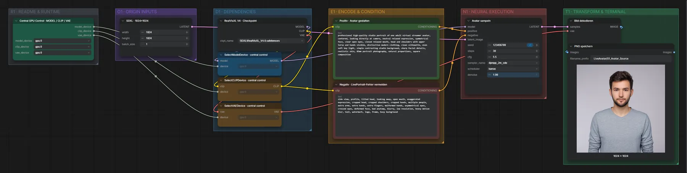
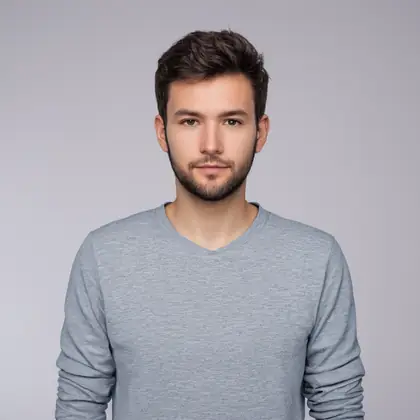

# Live Avatar 01 · SDXL RealVisXL · Avatar-Quellbild

**Workflow-Datei:** [`workflows/Live Avatar/LiveAvatar-01-SDXL-Avatar-Generation.json`](../../../workflows/Live%20Avatar/LiveAvatar-01-SDXL-Avatar-Generation.json)  
**Kategorie:** Live Avatar · **Eingabe → Ausgabe:** Text → Bild

Frontal-Porträt für LivePortrait (neutraler Blick, geschlossener Mund).

Interaktiv mit Zoom, Vergleichen und Kopier-Buttons: <https://dawasteh.github.io/DaWastehs-ComfyUI-Bundle/#/w/liveavatar-01-sdxl-avatar-generation>

## Modelle

| Rolle | Datei | Quant | Größe |
|---|---|---|---:|
| Modell | `RealVisXL_V4.0.safetensors` | FP16 | 6,5 GiB |

## Workflow in ComfyUI

Screenshot nach dem Hauptbeispiel (Eingaben und Ergebnis im Workflow, Erklärungstafeln ausgeblendet):

[](workflow.webp)

## Beispiele

### Avatar-Quellbild erzeugen

Negativ:

```text
side view, profile, tilted head, looking away, open mouth, exaggerated expression, cropped head, cropped shoulders, cropped hands, multiple people, extra arms, extra hands, extra fingers, malformed hands, asymmetrical eyes, crossed eyes, deformed face, bad anatomy, blurry, low resolution, heavy motion blur, text, watermark, logo, frame, busy background
```

| Einstellung | Wert |
|---|---|
| seed | 123456789 |
| steps | 30 |
| cfg | 5.5 |
| sampler_name | dpmpp_2m_sde |
| scheduler | karras |
| denoise | 1.0 |
| Dauer (Ausführung) | 19 s |
| VRAM R9700 (belegt / PyTorch-Spitze) | 18,0 GiB / 12,4 GiB |
| RAM (ComfyUI-Prozess) | 7,8 GiB |

Mitgelieferter Avatar-Prompt.

Ausgabe · PNG speichern: [](default.webp) · [Volle Auflösung (1024×1024, WebP mit Workflow – per Drag & Drop in ComfyUI ladbar)](default.webp)
