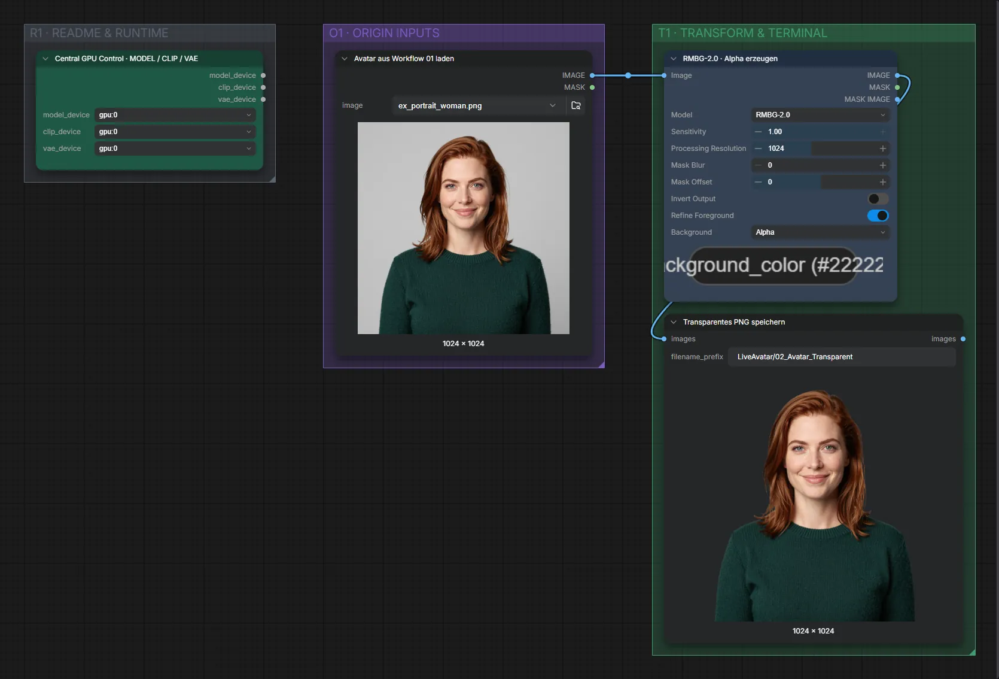

# Live Avatar 02 · RMBG · Avatar freistellen

**Workflow-Datei:** [`workflows/Live Avatar/LiveAvatar-02-RMBG-Transparency.json`](../../../workflows/Live%20Avatar/LiveAvatar-02-RMBG-Transparency.json)  
**Kategorie:** Live Avatar · **Eingabe → Ausgabe:** Bild → Bild (RGBA)

Transparentes PNG für die Spout/OBS-Workflows.

Interaktiv mit Zoom, Vergleichen und Kopier-Buttons: <https://dawasteh.github.io/DaWastehs-ComfyUI-Bundle/#/w/liveavatar-02-rmbg-transparency>

## Workflow in ComfyUI

Screenshot nach dem Hauptbeispiel (Eingaben und Ergebnis im Workflow, Erklärungstafeln ausgeblendet):

## Beispiele

### Avatar freistellen

| Einstellung | Wert |
|---|---|
| Dauer (Ausführung) | 2 s |
| VRAM R9700 (belegt / PyTorch-Spitze) | 10,2 GiB / 4,8 GiB |
| RAM (ComfyUI-Prozess) | 2,7 GiB |

Eingabe · ex_portrait_woman.png:  ([Datei](input_ex_portrait_woman.webp))  
Ausgabe · Transparentes PNG speichern:  · [Volle Auflösung (1024×1024, WebP mit Workflow – per Drag & Drop in ComfyUI ladbar)](woman.webp)
