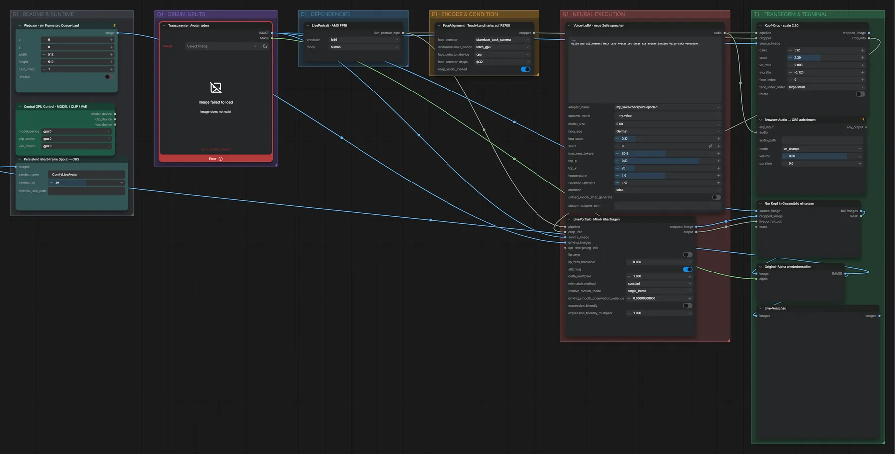

# Live Avatar 04 · LivePortrait + Qwen3-TTS-LoRA

**Workflow-Datei:** [`workflows/Live Avatar/LiveAvatar-04-LivePortrait-Webcam-Spout-OBS+Qwen3TTS-Voice-LoRA.json`](../../../workflows/Live%20Avatar/LiveAvatar-04-LivePortrait-Webcam-Spout-OBS%2BQwen3TTS-Voice-LoRA.json)  
**Kategorie:** Live Avatar · **Eingabe → Ausgabe:** Bild + Webcam + Text → Live-Video + Sprache

Wie 03, dazu spricht der Avatar Text mit der eigenen Stimmen-LoRA.

Interaktiv mit Zoom, Vergleichen und Kopier-Buttons: <https://dawasteh.github.io/DaWastehs-ComfyUI-Bundle/#/w/liveavatar-04-liveportrait-webcam-spout-obs-qwen3tts-voice-lora>

> Kein Beispiel: Echtzeit-Workflow (Webcam/Spout/OBS bzw. Mikrofon); die Ausgabe ist ein Live-Stream.

## Workflow in ComfyUI

Screenshot nach dem Hauptbeispiel (Eingaben und Ergebnis im Workflow, Erklärungstafeln ausgeblendet):

