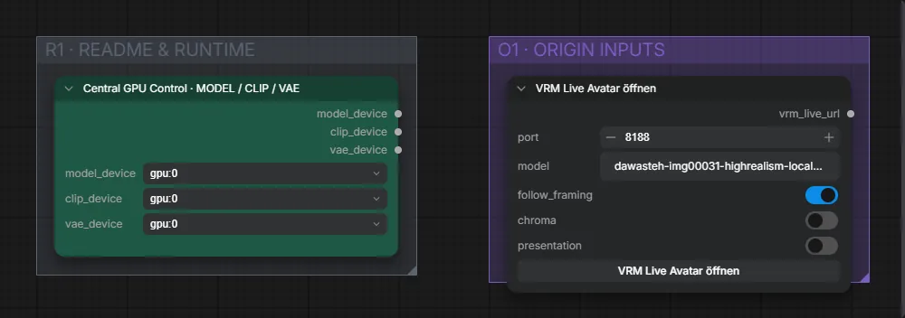

# Live Avatar 06 · VRM-Ganzkörper mit Händen, Gesicht und Mikro

**Workflow-Datei:** [`workflows/Live Avatar/LiveAvatar-06-VRM-Full-Body-Hand-Face+Live-Mic.json`](../../../workflows/Live%20Avatar/LiveAvatar-06-VRM-Full-Body-Hand-Face%2BLive-Mic.json)  
**Kategorie:** Live Avatar · **Eingabe → Ausgabe:** Webcam + Mikrofon → Live-Video

Startet den Browser-VRM-Avatar mit Körper-, Hand- und Gesichtstracking.

Interaktiv mit Zoom, Vergleichen und Kopier-Buttons: <https://dawasteh.github.io/DaWastehs-ComfyUI-Bundle/#/w/liveavatar-06-vrm-full-body-hand-face-live-mic>

> Kein Beispiel: Echtzeit-Workflow (Webcam/Spout/OBS bzw. Mikrofon); die Ausgabe ist ein Live-Stream.

## Workflow in ComfyUI

Screenshot nach dem Hauptbeispiel (Eingaben und Ergebnis im Workflow, Erklärungstafeln ausgeblendet):

