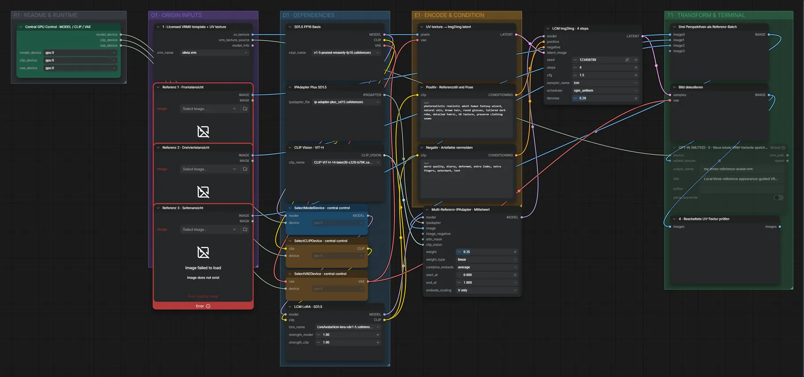

# Live Avatar 08 · lokale VRM-Textur erstellen

**Workflow-Datei:** [`workflows/Live Avatar/LiveAvatar-08-Local-VRM-Texture-Creator-Realistic+Stylized.json`](../../../workflows/Live%20Avatar/LiveAvatar-08-Local-VRM-Texture-Creator-Realistic%2BStylized.json)  
**Kategorie:** Live Avatar · **Eingabe → Ausgabe:** Bild → Textur

Referenzbilder → neue UV-Textur für ein vorhandenes VRM-Modell.

Interaktiv mit Zoom, Vergleichen und Kopier-Buttons: <https://dawasteh.github.io/DaWastehs-ComfyUI-Bundle/#/w/liveavatar-08-local-vrm-texture-creator-realistic-stylized>

> Kein Beispiel: braucht ein lokales VRM-Modell und seine UV-Vorlage.

## Modelle

| Rolle | Datei | Quant | Größe |
|---|---|---|---:|
| Modell | `v1-5-pruned-emaonly-fp16.safetensors` | FP16 | 2,0 GiB |
| LoRA | `lcm-lora-sdv1-5.safetensors` | FP16 | 0,1 GiB |
| IP-Adapter | `ip-adapter-plus_sd15.safetensors` | FP16 | 0,1 GiB |
| Vision-Encoder | `CLIP-ViT-H-14-laion2B-s32B-b79K.safetensors` | FP32 | 2,4 GiB |

## Workflow in ComfyUI

Screenshot nach dem Hauptbeispiel (Eingaben und Ergebnis im Workflow, Erklärungstafeln ausgeblendet):

