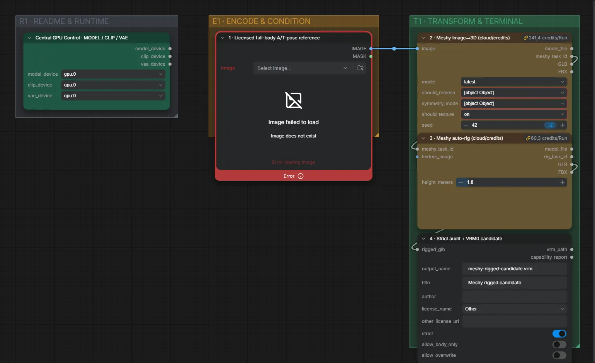

# Live Avatar 09 · Meshy Auto-Rig → VRM (Cloud)

**Workflow-Datei:** [`workflows/Live Avatar/LiveAvatar-09-Meshy-AutoRig-to-VRM-Candidate-Optional-Cloud.json`](../../../workflows/Live%20Avatar/LiveAvatar-09-Meshy-AutoRig-to-VRM-Candidate-Optional-Cloud.json)  
**Kategorie:** Live Avatar · **Eingabe → Ausgabe:** Bild → 3D-Modell

Optionaler Cloud-Weg über Meshy (kostet Credits).

Interaktiv mit Zoom, Vergleichen und Kopier-Buttons: <https://dawasteh.github.io/DaWastehs-ComfyUI-Bundle/#/w/liveavatar-09-meshy-autorig-to-vrm-candidate-optional-cloud>

> Kein Beispiel: nutzt einen kostenpflichtigen Cloud-Dienst.

## Workflow in ComfyUI

Screenshot nach dem Hauptbeispiel (Eingaben und Ergebnis im Workflow, Erklärungstafeln ausgeblendet):

