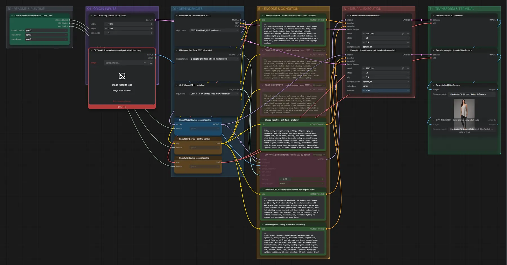
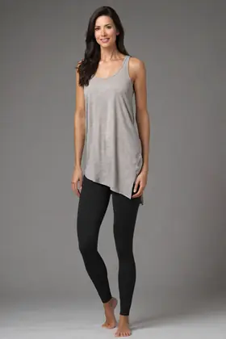

# Live Avatar 10 · SDXL · realistische Charakter-Referenz

**Workflow-Datei:** [`workflows/Live Avatar/LiveAvatar-10-Realistic-Adult-Character-Reference-Prompt+Image.json`](../../../workflows/Live%20Avatar/LiveAvatar-10-Realistic-Adult-Character-Reference-Prompt%2BImage.json)  
**Kategorie:** Live Avatar · **Eingabe → Ausgabe:** Text → Bild

Ganzkörper-Referenz (bekleidet) aus Prompt, optional mit Porträt.

Interaktiv mit Zoom, Vergleichen und Kopier-Buttons: <https://dawasteh.github.io/DaWastehs-ComfyUI-Bundle/#/w/liveavatar-10-realistic-adult-character-reference-prompt-image>

## Modelle

| Rolle | Datei | Quant | Größe |
|---|---|---|---:|
| Modell | `RealVisXL_V4.0.safetensors` | FP16 | 6,5 GiB |
| IP-Adapter | `ip-adapter-plus-face_sdxl_vit-h.safetensors` | FP16 | 0,8 GiB |
| Vision-Encoder | `CLIP-ViT-H-14-laion2B-s32B-b79K.safetensors` | FP32 | 2,4 GiB |

## Workflow in ComfyUI

Screenshot nach dem Hauptbeispiel (Eingaben und Ergebnis im Workflow, Erklärungstafeln ausgeblendet):

[](workflow.webp)

## Beispiele

### Charakter-Referenz (bekleidet)

Negativ:

```text
child, minor, teenager, young-looking, ambiguous age, age regression, multiple people, duplicate person, cropped head, cropped feet, out of frame, sitting, bent knees, crossed arms, extra limbs, missing limbs, duplicate limbs, malformed hands, deformed hands, extra fingers, missing fingers, fused fingers, webbed fingers, broken wrists, bad anatomy, asymmetrical limbs, text, letters, words, logo, watermark, signature, typography, captions, subtitles, UI, user interface, QR code, emblem, brand mark, label, badge, poster, signage, tattoo, jewelry, props, busy background, low resolution, blurry, explicit sexual activity, erotic, sexualized, seductive, fetish, pornographic pose, spread legs, lingerie, genital close-up, breast close-up, aroused expression, censored bar, mosaic
```

| Einstellung | Wert |
|---|---|
| seed | 27031991 |
| steps | 28 |
| cfg | 5.5 |
| sampler_name | dpmpp_2m |
| scheduler | karras |
| denoise | 1.0 |
| Dauer (Ausführung) | 14 s |
| VRAM R9700 (belegt / PyTorch-Spitze) | 24,0 GiB / 15,3 GiB |
| RAM (ComfyUI-Prozess) | 8,0 GiB |

Mitgelieferter Preset 1; der optionale Zweig bleibt aus.

Ausgabe · Save clothed 2D reference: [](default.webp) · [Volle Auflösung (1024×1536, WebP mit Workflow – per Drag & Drop in ComfyUI ladbar)](default.webp)
