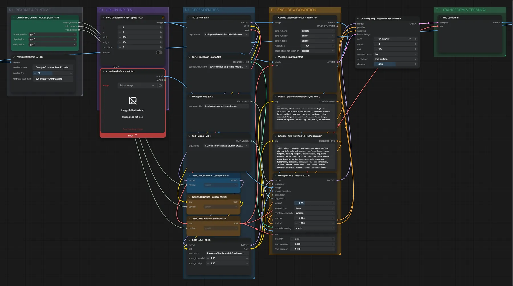

# Live Avatar 11 · Webcam → KI-Figur mit OpenPose-Cache

**Workflow-Datei:** [`workflows/Live Avatar/LiveAvatar-11-AI-Webcam-Character-Swap-Cached-OpenPose.json`](../../../workflows/Live%20Avatar/LiveAvatar-11-AI-Webcam-Character-Swap-Cached-OpenPose.json)  
**Kategorie:** Live Avatar · **Eingabe → Ausgabe:** Webcam + Bild → Live-Video

Schnellere Variante von 07.

Interaktiv mit Zoom, Vergleichen und Kopier-Buttons: <https://dawasteh.github.io/DaWastehs-ComfyUI-Bundle/#/w/liveavatar-11-ai-webcam-character-swap-cached-openpose>

> Kein Beispiel: Echtzeit-Workflow (Webcam/Spout/OBS bzw. Mikrofon); die Ausgabe ist ein Live-Stream.

## Modelle

| Rolle | Datei | Quant | Größe |
|---|---|---|---:|
| Modell | `v1-5-pruned-emaonly-fp16.safetensors` | FP16 | 2,0 GiB |
| LoRA | `lcm-lora-sdv1-5.safetensors` | FP16 | 0,1 GiB |
| ControlNet | `control_v11p_sd15_openpose_fp16.safetensors` | FP16 | 0,7 GiB |
| IP-Adapter | `ip-adapter-plus_sd15.safetensors` | FP16 | 0,1 GiB |
| Vision-Encoder | `CLIP-ViT-H-14-laion2B-s32B-b79K.safetensors` | FP32 | 2,4 GiB |

## Workflow in ComfyUI

Screenshot nach dem Hauptbeispiel (Eingaben und Ergebnis im Workflow, Erklärungstafeln ausgeblendet):

