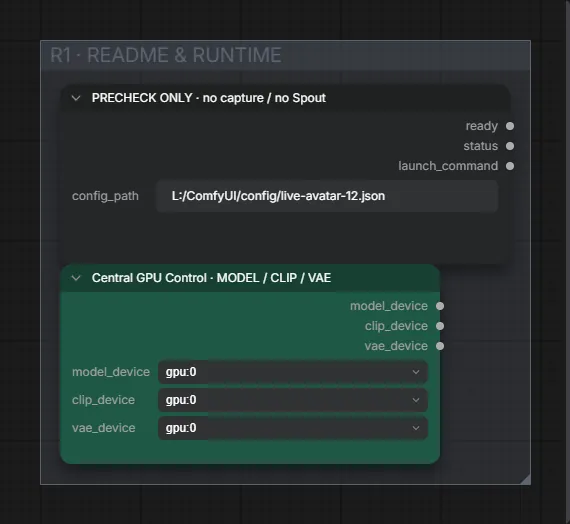

# Live Avatar 12-I · DirectML-Gesichtsklon-Vergleich

**Workflow-Datei:** [`workflows/Live Avatar/LiveAvatar-12-I-DirectML-Face-Clone-Bakeoff.json`](../../../workflows/Live%20Avatar/LiveAvatar-12-I-DirectML-Face-Clone-Bakeoff.json)  
**Kategorie:** Live Avatar · **Eingabe → Ausgabe:** – → Text

Vorabprüfung der DirectML-Pfade.

Interaktiv mit Zoom, Vergleichen und Kopier-Buttons: <https://dawasteh.github.io/DaWastehs-ComfyUI-Bundle/#/w/liveavatar-12-i-directml-face-clone-bakeoff>

> Kein Beispiel: Echtzeit-Workflow (Webcam/Spout/OBS bzw. Mikrofon); die Ausgabe ist ein Live-Stream.

## Workflow in ComfyUI

Screenshot nach dem Hauptbeispiel (Eingaben und Ergebnis im Workflow, Erklärungstafeln ausgeblendet):

