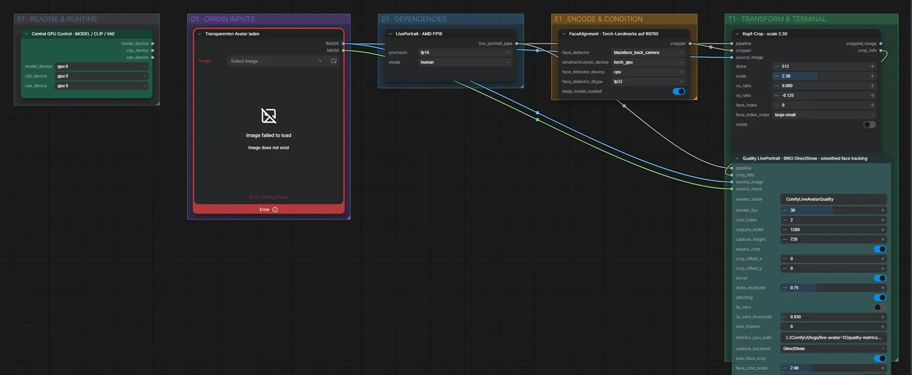

# Live Avatar 12-II · LivePortrait-Qualitätsmodus

**Workflow-Datei:** [`workflows/Live Avatar/LiveAvatar-12-II-LivePortrait-Quality-Mode.json`](../../../workflows/Live%20Avatar/LiveAvatar-12-II-LivePortrait-Quality-Mode.json)  
**Kategorie:** Live Avatar · **Eingabe → Ausgabe:** Bild + Webcam → Live-Video

Geglättetes Gesichtstracking für ruhigere Ausgabe.

Interaktiv mit Zoom, Vergleichen und Kopier-Buttons: <https://dawasteh.github.io/DaWastehs-ComfyUI-Bundle/#/w/liveavatar-12-ii-liveportrait-quality-mode>

> Kein Beispiel: Echtzeit-Workflow (Webcam/Spout/OBS bzw. Mikrofon); die Ausgabe ist ein Live-Stream.

## Workflow in ComfyUI

Screenshot nach dem Hauptbeispiel (Eingaben und Ergebnis im Workflow, Erklärungstafeln ausgeblendet):

