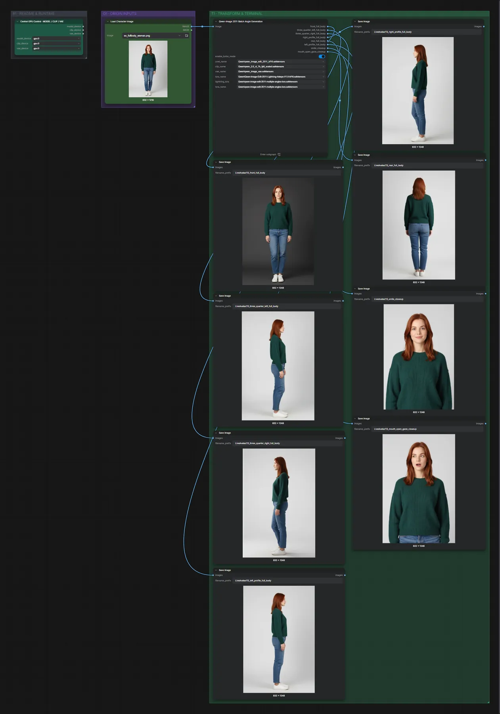
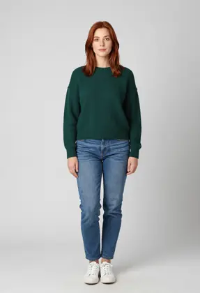
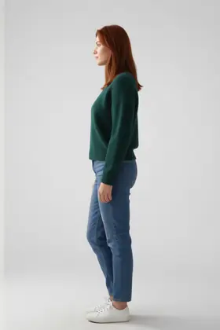
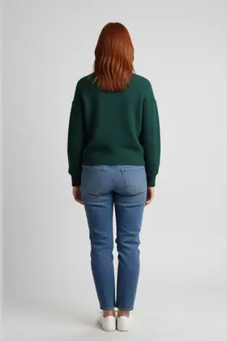
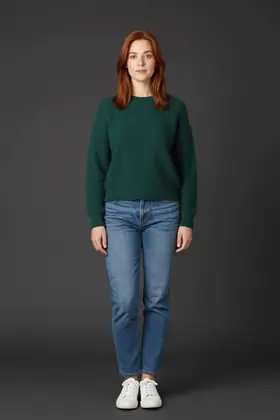
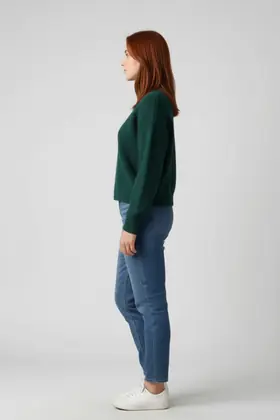
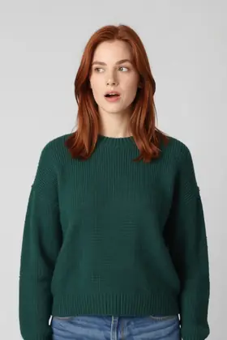
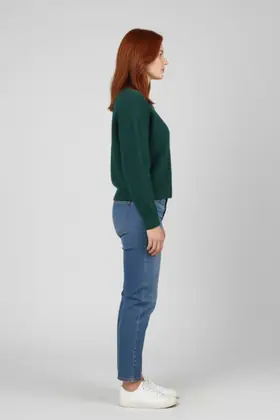

# Live Avatar 13 · Qwen Image Edit 2511 · Charakterblatt

**Workflow-Datei:** [`workflows/Live Avatar/LiveAvatar-13-Synthetic-Character-Sheet.json`](../../../workflows/Live%20Avatar/LiveAvatar-13-Synthetic-Character-Sheet.json)  
**Kategorie:** Live Avatar · **Eingabe → Ausgabe:** Bild → Bilder

Aus einem Ganzkörperfoto entstehen Front-, Seiten-, Rücken- und Nahansichten für die Avatar-Workflows.

Interaktiv mit Zoom, Vergleichen und Kopier-Buttons: <https://dawasteh.github.io/DaWastehs-ComfyUI-Bundle/#/w/liveavatar-13-synthetic-character-sheet>

## Modelle

| Rolle | Datei | Quant | Größe |
|---|---|---|---:|
| Modell | `qwen_image_edit_2511_bf16.safetensors` | BF16 | 38,0 GiB |
| Modell | `qwen_2.5_vl_7b_fp8_scaled.safetensors` | FP8 | 8,7 GiB |
| Modell | `qwen_image_vae.safetensors` | BF16 | 0,2 GiB |
| Modell | `Qwen-Image-Edit-2511-Lightning-4steps-V1.0-bf16.safetensors` | BF16 | 0,8 GiB |
| Modell | `qwen-image-edit-2511-multiple-angles-lora.safetensors` | BF16 | 0,3 GiB |

## Workflow in ComfyUI

Screenshot nach dem Hauptbeispiel (Eingaben und Ergebnis im Workflow, Erklärungstafeln ausgeblendet):

## Beispiele

### Charakterblatt aus einem Ganzkörperfoto

| Einstellung | Wert |
|---|---|
| Dauer (Ausführung) | 12 min 13 s |
| VRAM R9700 (belegt / PyTorch-Spitze) | 30,5 GiB / 26,4 GiB |
| RAM (ComfyUI-Prozess) | 33,7 GiB |

Eingabe · ex_fullbody_woman.png:  ([Datei](input_ex_fullbody_woman.webp))  
Ausgabe · Bild 1:  · [Volle Auflösung (832×1248, WebP mit Workflow – per Drag & Drop in ComfyUI ladbar)](woman__n376.webp)  
Ausgabe · Bild 2:   
Ausgabe · Bild 3:   
Ausgabe · Bild 4:   
Ausgabe · Bild 5:   
Ausgabe · Bild 6:   
Ausgabe · Bild 7:   
Ausgabe · Bild 8: 
