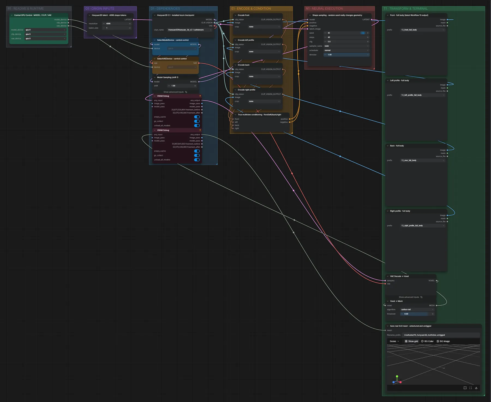

# Live Avatar 14 · Hunyuan3D · vier Ansichten → Mesh

**Workflow-Datei:** [`workflows/Live Avatar/LiveAvatar-14-Local-Hunyuan3D-Multiview-Mesh-Unrigged.json`](../../../workflows/Live%20Avatar/LiveAvatar-14-Local-Hunyuan3D-Multiview-Mesh-Unrigged.json)  
**Kategorie:** Live Avatar · **Eingabe → Ausgabe:** Bilder → 3D-Modell

Nimmt die neuesten Ansichten aus Workflow 13 und baut ein Mesh (ohne Rig).

Interaktiv mit Zoom, Vergleichen und Kopier-Buttons: <https://dawasteh.github.io/DaWastehs-ComfyUI-Bundle/#/w/liveavatar-14-local-hunyuan3d-multiview-mesh-unrigged>

## Modelle

| Rolle | Datei | Quant | Größe |
|---|---|---|---:|
| Modell | `hunyuan_3d_v2.1.safetensors` | FP16 | 6,9 GiB |

## Workflow in ComfyUI

Screenshot nach dem Hauptbeispiel (Eingaben und Ergebnis im Workflow, Erklärungstafeln ausgeblendet):

## Beispiele

### Charakterblatt (Workflow 13) → 3D-Mesh aus vier Ansichten

| Einstellung | Wert |
|---|---|
| seed | 42 |
| shift | 1 |
| steps | 40 |
| cfg | 5 |
| sampler_name | euler |
| scheduler | normal |
| denoise | 1 |
| Dauer (Ausführung) | 1 min 52 s |
| VRAM R9700 (belegt / PyTorch-Spitze) | 10,3 GiB / 7,2 GiB |
| RAM (ComfyUI-Prozess) | 14,6 GiB |

Liest die neuesten Ansichten aus dem Charakterblatt-Beispiel (Workflow 13).

Ausgabe · Save real GLB mesh · untextured and unrigged: [woman.glb](woman.glb)
