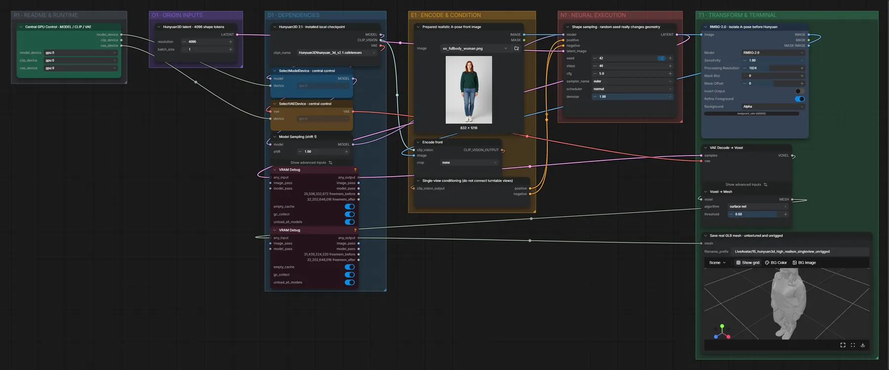

# Live Avatar 15 · Hunyuan3D · Ganzkörperfoto → Mesh

**Workflow-Datei:** [`workflows/Live Avatar/LiveAvatar-15-Local-High-Realism-VRM.json`](../../../workflows/Live%20Avatar/LiveAvatar-15-Local-High-Realism-VRM.json)  
**Kategorie:** Live Avatar · **Eingabe → Ausgabe:** Bild → 3D-Modell

Single-View-Mesh aus einem A-Pose-Foto (ohne Rig).

Interaktiv mit Zoom, Vergleichen und Kopier-Buttons: <https://dawasteh.github.io/DaWastehs-ComfyUI-Bundle/#/w/liveavatar-15-local-high-realism-vrm>

## Modelle

| Rolle | Datei | Quant | Größe |
|---|---|---|---:|
| Modell | `hunyuan_3d_v2.1.safetensors` | FP16 | 6,9 GiB |

## Workflow in ComfyUI

Screenshot nach dem Hauptbeispiel (Eingaben und Ergebnis im Workflow, Erklärungstafeln ausgeblendet):

## Beispiele

### Ganzkörperfoto → 3D-Mesh (ohne Rig)

| Einstellung | Wert |
|---|---|
| seed | 42 |
| shift | 1 |
| steps | 40 |
| cfg | 5 |
| sampler_name | euler |
| scheduler | normal |
| denoise | 1 |
| Dauer (Ausführung) | 8 min 5 s |
| VRAM R9700 (belegt / PyTorch-Spitze) | 16,4 GiB / 10,5 GiB |
| RAM (ComfyUI-Prozess) | 29,8 GiB |

Eingabe · ex_fullbody_woman.png:  ([Datei](input_ex_fullbody_woman.webp))  
Ausgabe · Save real GLB mesh · untextured and unrigged: [woman.glb](woman.glb)
