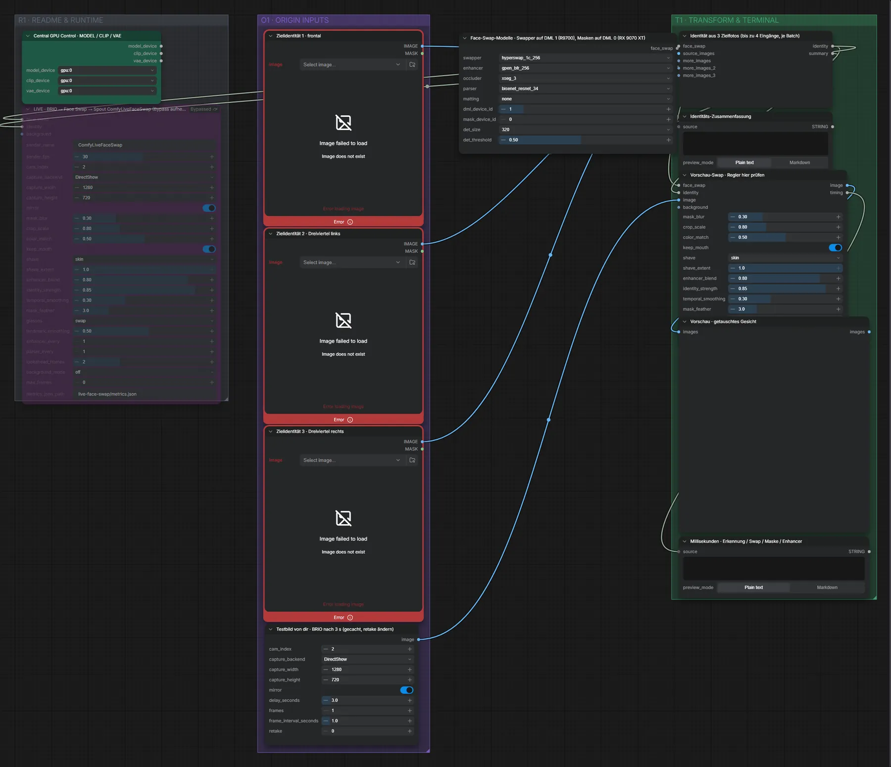

# Live Avatar 16 · Live-Face-Swap (DirectML) → Spout/OBS

**Workflow-Datei:** [`workflows/Live Avatar/LiveAvatar-16-Live-Face-Swap-DirectML-Spout-OBS.json`](../../../workflows/Live%20Avatar/LiveAvatar-16-Live-Face-Swap-DirectML-Spout-OBS.json)  
**Kategorie:** Live Avatar · **Eingabe → Ausgabe:** Bild + Webcam → Live-Video

Gesichtstausch in Echtzeit mit drei Zielbildern.

Interaktiv mit Zoom, Vergleichen und Kopier-Buttons: <https://dawasteh.github.io/DaWastehs-ComfyUI-Bundle/#/w/liveavatar-16-live-face-swap-directml-spout-obs>

> Kein Beispiel: Echtzeit-Workflow (Webcam/Spout/OBS bzw. Mikrofon); die Ausgabe ist ein Live-Stream.

## Workflow in ComfyUI

Screenshot nach dem Hauptbeispiel (Eingaben und Ergebnis im Workflow, Erklärungstafeln ausgeblendet):

