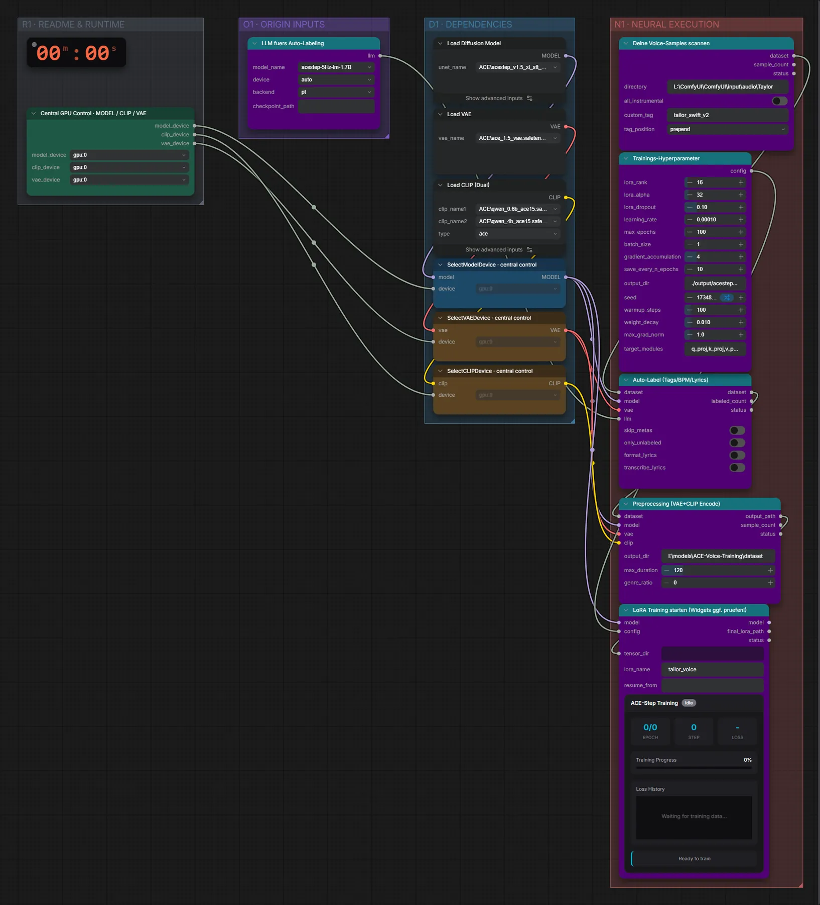

# ACE-Step 1.5 XL SFT (BF16) · Songs → Stimmen-LoRA

**Workflow-Datei:** [`workflows/LoRA Generation/ACE_Step1_5_XL_SFT_BF16-Songs-to-Voice-LoRA.json`](../../../workflows/LoRA%20Generation/ACE_Step1_5_XL_SFT_BF16-Songs-to-Voice-LoRA.json)  
**Kategorie:** LoRA Generation · **Eingabe → Ausgabe:** Songs → LoRA · **Quant:** BF16

Bis v1.3.0 hieß der Workflow `ACE-Step1_5_XL-Voice-LoRA-Training.json`.

Lokales LoRA-Training auf RDNA4 mit VRAM-Guard und Checkpointing; Datensatz aus dem ComfyUI-Eingabeordner.

Interaktiv mit Zoom, Vergleichen und Kopier-Buttons: <https://dawasteh.github.io/DaWastehs-ComfyUI-Bundle/#/w/ace-step1-5-xl-sft-bf16-songs-to-voice-lora>

> Kein Beispiel: Training dauert Stunden und braucht einen eigenen Datensatz; das Ergebnis ist eine LoRA-Datei, die in den passenden Generierungs-Workflows geladen wird.

## Modelle

| Rolle | Datei | Quant | Größe |
|---|---|---|---:|
| Diffusionsmodell | `acestep_v1.5_xl_sft_bf16.safetensors` | BF16 | 9,3 GiB |
| VAE | `ace_1.5_vae.safetensors` | BF16 | 0,3 GiB |
| Text-Encoder | `qwen_0.6b_ace15.safetensors` | BF16 | 1,1 GiB |
| Text-Encoder | `qwen_4b_ace15.safetensors` | BF16 | 7,8 GiB |

## Workflow in ComfyUI

Screenshot nach dem Hauptbeispiel (Eingaben und Ergebnis im Workflow, Erklärungstafeln ausgeblendet):

