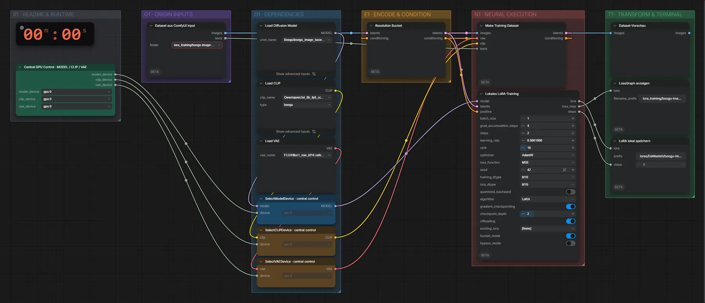

# Boogu Image Base (BF16) · Bilder → LoRA

**Workflow-Datei:** [`workflows/LoRA Generation/Boogu_Image_Base_BF16-Images-to-LoRA.json`](../../../workflows/LoRA%20Generation/Boogu_Image_Base_BF16-Images-to-LoRA.json)  
**Kategorie:** LoRA Generation · **Eingabe → Ausgabe:** Bilder → LoRA · **Quant:** BF16

Bis v1.3.0 hieß der Workflow `Boogu_Image_Base-LoRA-Training.json`.

Lokales LoRA-Training auf RDNA4 mit VRAM-Guard und Checkpointing; Datensatz aus dem ComfyUI-Eingabeordner.

Interaktiv mit Zoom, Vergleichen und Kopier-Buttons: <https://dawasteh.github.io/DaWastehs-ComfyUI-Bundle/#/w/boogu-image-base-bf16-images-to-lora>

> Kein Beispiel: Training dauert Stunden und braucht einen eigenen Datensatz; das Ergebnis ist eine LoRA-Datei, die in den passenden Generierungs-Workflows geladen wird.

## Modelle

| Rolle | Datei | Quant | Größe |
|---|---|---|---:|
| Diffusionsmodell | `boogu_image_base_bf16.safetensors` | BF16 | 19,2 GiB |
| Text-Encoder / LLM | `qwen3vl_8b_fp8_scaled.safetensors` | FP8 | 9,9 GiB |
| VAE | `flux1_vae_bf16.safetensors` | BF16 | 0,2 GiB |

## Workflow in ComfyUI

Screenshot nach dem Hauptbeispiel (Eingaben und Ergebnis im Workflow, Erklärungstafeln ausgeblendet):

