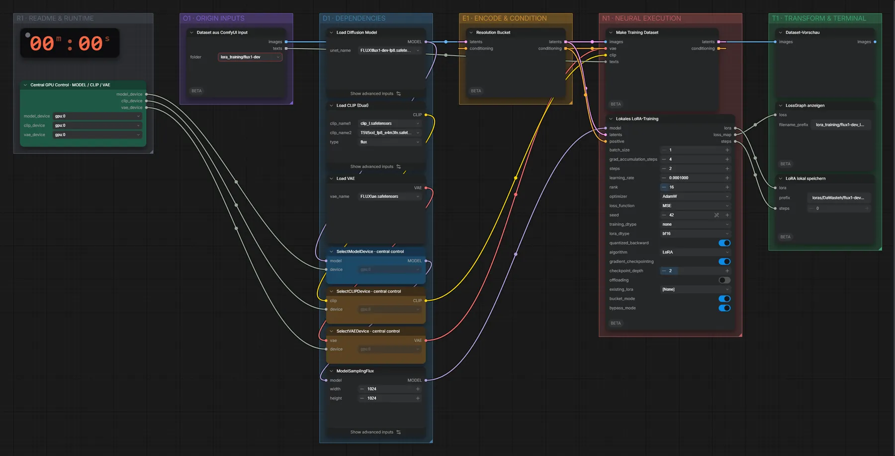

# FLUX.1 dev (FP8) · Bilder → LoRA

**Workflow-Datei:** [`workflows/LoRA Generation/FLUX1_Dev_FP8-Images-to-LoRA.json`](../../../workflows/LoRA%20Generation/FLUX1_Dev_FP8-Images-to-LoRA.json)  
**Kategorie:** LoRA Generation · **Eingabe → Ausgabe:** Bilder → LoRA · **Quant:** FP8

Bis v1.3.0 hieß der Workflow `FLUX1_Dev-LoRA-Training.json`.

Lokales LoRA-Training auf RDNA4 mit VRAM-Guard und Checkpointing; Datensatz aus dem ComfyUI-Eingabeordner.

Interaktiv mit Zoom, Vergleichen und Kopier-Buttons: <https://dawasteh.github.io/DaWastehs-ComfyUI-Bundle/#/w/flux1-dev-fp8-images-to-lora>

> Kein Beispiel: Training dauert Stunden und braucht einen eigenen Datensatz; das Ergebnis ist eine LoRA-Datei, die in den passenden Generierungs-Workflows geladen wird.

## Modelle

| Rolle | Datei | Quant | Größe |
|---|---|---|---:|
| Diffusionsmodell | `flux1-dev-fp8.safetensors` | FP8 | 11,5 GiB |
| Text-Encoder | `clip_l.safetensors` | FP16 | 0,2 GiB |
| Text-Encoder | `t5xxl_fp8_e4m3fn.safetensors` | FP8 | 4,6 GiB |
| VAE | `ae.safetensors` | FP32 | 0,3 GiB |

## Workflow in ComfyUI

Screenshot nach dem Hauptbeispiel (Eingaben und Ergebnis im Workflow, Erklärungstafeln ausgeblendet):

