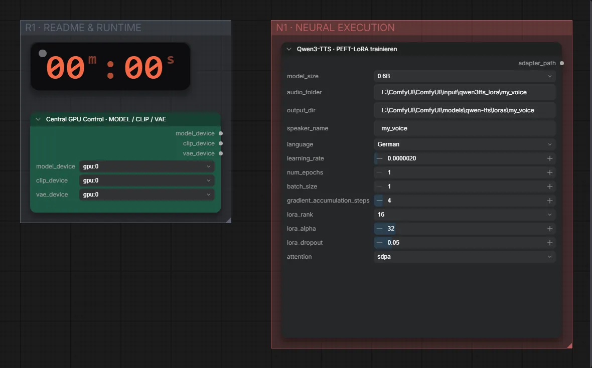

# Qwen3-TTS 0.6B · Aufnahmen → Stimmen-LoRA

**Workflow-Datei:** [`workflows/LoRA Generation/Qwen3_TTS_0_6B_Base-Recordings-to-Voice-LoRA.json`](../../../workflows/LoRA%20Generation/Qwen3_TTS_0_6B_Base-Recordings-to-Voice-LoRA.json)  
**Kategorie:** LoRA Generation · **Eingabe → Ausgabe:** Audio → LoRA

Bis v1.3.0 hieß der Workflow `Qwen3-TTS_0.6B-Voice-LoRA-Training.json`.

Lokales LoRA-Training auf RDNA4 mit VRAM-Guard und Checkpointing; Datensatz aus dem ComfyUI-Eingabeordner.

Interaktiv mit Zoom, Vergleichen und Kopier-Buttons: <https://dawasteh.github.io/DaWastehs-ComfyUI-Bundle/#/w/qwen3-tts-0-6b-base-recordings-to-voice-lora>

> Kein Beispiel: Training dauert Stunden und braucht einen eigenen Datensatz; das Ergebnis ist eine LoRA-Datei, die in den passenden Generierungs-Workflows geladen wird.

## Workflow in ComfyUI

Screenshot nach dem Hauptbeispiel (Eingaben und Ergebnis im Workflow, Erklärungstafeln ausgeblendet):

