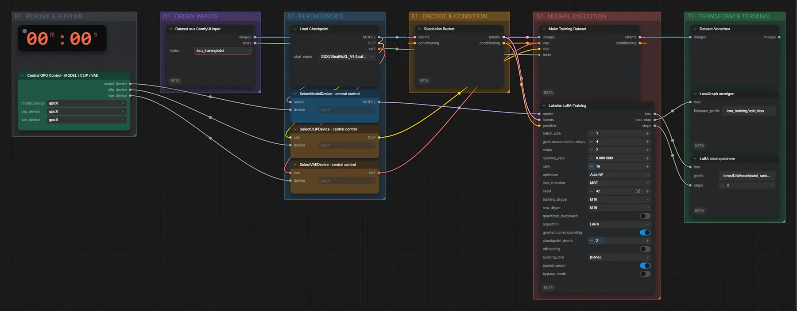

# SDXL RealVisXL (FP16) · Bilder → LoRA

**Workflow-Datei:** [`workflows/LoRA Generation/SDXL_RealVisXL_V4_FP16-Images-to-LoRA.json`](../../../workflows/LoRA%20Generation/SDXL_RealVisXL_V4_FP16-Images-to-LoRA.json)  
**Kategorie:** LoRA Generation · **Eingabe → Ausgabe:** Bilder → LoRA · **Quant:** FP16

Bis v1.3.0 hieß der Workflow `SDXL-LoRA-Training.json`.

Lokales LoRA-Training auf RDNA4 mit VRAM-Guard und Checkpointing; Datensatz aus dem ComfyUI-Eingabeordner.

Interaktiv mit Zoom, Vergleichen und Kopier-Buttons: <https://dawasteh.github.io/DaWastehs-ComfyUI-Bundle/#/w/sdxl-realvisxl-v4-fp16-images-to-lora>

> Kein Beispiel: Training dauert Stunden und braucht einen eigenen Datensatz; das Ergebnis ist eine LoRA-Datei, die in den passenden Generierungs-Workflows geladen wird.

## Modelle

| Rolle | Datei | Quant | Größe |
|---|---|---|---:|
| Modell | `RealVisXL_V4.0.safetensors` | FP16 | 6,5 GiB |

## Workflow in ComfyUI

Screenshot nach dem Hauptbeispiel (Eingaben und Ergebnis im Workflow, Erklärungstafeln ausgeblendet):

