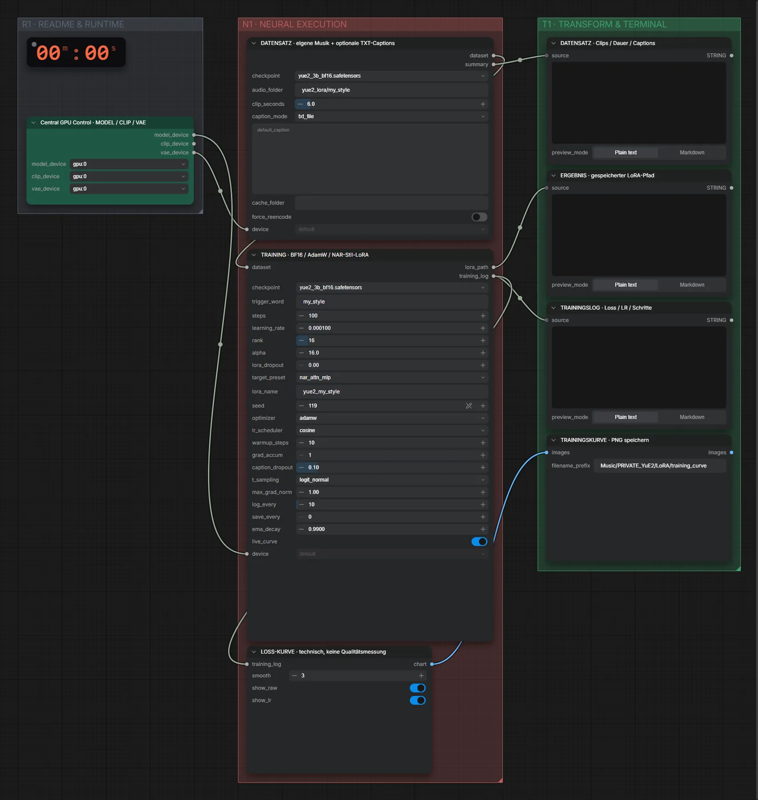

# YuE2 3B (BF16) · Songs → Stil-LoRA (privat)

**Workflow-Datei:** [`workflows/LoRA Generation/YuE2_3B_BF16-PRIVATE-Songs-to-Style-LoRA.json`](../../../workflows/LoRA%20Generation/YuE2_3B_BF16-PRIVATE-Songs-to-Style-LoRA.json)  
**Kategorie:** LoRA Generation · **Eingabe → Ausgabe:** Songs → LoRA · **Quant:** BF16

Bis v1.3.0 hieß der Workflow `YuE2_3B_BF16-PRIVATE-Style-LoRA-Training.json`.

Lokales LoRA-Training auf RDNA4 mit VRAM-Guard und Checkpointing; Datensatz aus dem ComfyUI-Eingabeordner.

Interaktiv mit Zoom, Vergleichen und Kopier-Buttons: <https://dawasteh.github.io/DaWastehs-ComfyUI-Bundle/#/w/yue2-3b-bf16-private-songs-to-style-lora>

> Kein Beispiel: Training dauert Stunden und braucht einen eigenen Datensatz; das Ergebnis ist eine LoRA-Datei, die in den passenden Generierungs-Workflows geladen wird.

## Modelle

| Rolle | Datei | Quant | Größe |
|---|---|---|---:|
| Modell | `yue2_3b_bf16.safetensors` | BF16 | 7,3 GiB |

## Workflow in ComfyUI

Screenshot nach dem Hauptbeispiel (Eingaben und Ergebnis im Workflow, Erklärungstafeln ausgeblendet):

