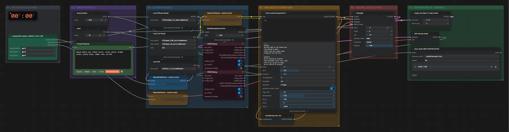

# ACE-Step 1.5 Turbo (BF16) · Stil-Tags + Songtext → Song

**Workflow-Datei:** [`workflows/Music Generation/ACE_Step1_5_Turbo_BF16-Tags+Lyrics-to-Song.json`](../../../workflows/Music%20Generation/ACE_Step1_5_Turbo_BF16-Tags%2BLyrics-to-Song.json)  
**Kategorie:** Music Generation · **Eingabe → Ausgabe:** Tags + Songtext → Song · **Quant:** BF16

Bis v1.3.0 hieß der Workflow `ACE-Step1_5_Turbo_4B-Music-Generation.json`.

Der schnelle ACE-Step: 8 Schritte für einen kompletten Song mit Gesang; Sprache, Tonart und Tempo einstellbar.

Interaktiv mit Zoom, Vergleichen und Kopier-Buttons: <https://dawasteh.github.io/DaWastehs-ComfyUI-Bundle/#/w/ace-step1-5-turbo-bf16-tags-lyrics-to-song>

## Modelle

| Rolle | Datei | Quant | Größe |
|---|---|---|---:|
| Diffusionsmodell | `acestep_v1.5_turbo.safetensors` | BF16 | 4,5 GiB |
| VAE | `ace_1.5_vae.safetensors` | BF16 | 0,3 GiB |
| Text-Encoder | `qwen_0.6b_ace15.safetensors` | BF16 | 1,1 GiB |
| Text-Encoder | `qwen_4b_ace15.safetensors` | BF16 | 7,8 GiB |

## Workflow in ComfyUI

Screenshot nach dem Hauptbeispiel (Eingaben und Ergebnis im Workflow, Erklärungstafeln ausgeblendet):

[](workflow.webp)

## Beispiele

### Pop · englisch

Prompt:

```text
upbeat modern pop, female vocals, catchy chorus, bright synths, punchy drums, summer vibe, 118 BPM
```

| Einstellung | Wert |
|---|---|
| lyrics | [Verse]
Morning light on the window pane
City waking up again
Coffee cups and a paper plane
Flying out into the rain

[Chorus]
We are running on sunshine
Every heartbeat feels like a sign
Turn it up, we got all night
We are running on sunshine

[Verse]
Neon signs on a subway train
Every stranger knows my name
Dancing through the evening haze
We don't need to change a thing

[Chorus]
We are running on sunshine
Every heartbeat feels like a sign
Turn it up, we got all night
We are running on sunshine |
| duration | 60 s |
| seed | 42 |
| language | en |
| steps | 8 |
| cfg | 1 |
| sampler_name | euler |
| scheduler | normal |
| denoise | 1 |
| shift | 3 |
| Dauer (Ausführung) | 27 s |
| VRAM R9700 (belegt / PyTorch-Spitze) | 20,7 GiB / 21,1 GiB |
| RAM (ComfyUI-Prozess) | 10,3 GiB |

Ausgabe · Ausgabe: [pop.mp3](pop.mp3)  

### Indie-Rock · deutsch

Prompt:

```text
energetic German indie rock, male vocals, distorted electric guitars, driving drums, anthemic chorus, 140 BPM
```

| Einstellung | Wert |
|---|---|
| lyrics | [Verse]
Wir fahren nachts durch leere Straßen
die Stadt schläft, doch wir sind wach
die Lichter ziehen an uns vorbei
wie Sterne über dem Dach

[Chorus]
Wir sind laut, wir sind hier
nichts hält uns heute auf
wir sind laut, wir sind hier
und die Nacht nimmt ihren Lauf

[Verse]
Ein altes Radio, ein kaputter Sitz
wir singen jedes Lied mit
der Morgen kommt, doch nicht so schnell
wir halten noch ein bisschen Schritt

[Chorus]
Wir sind laut, wir sind hier
nichts hält uns heute auf
wir sind laut, wir sind hier
und die Nacht nimmt ihren Lauf |
| duration | 60 s |
| seed | 42 |
| language | de |
| steps | 8 |
| cfg | 1 |
| sampler_name | euler |
| scheduler | normal |
| denoise | 1 |
| shift | 3 |
| Dauer (Ausführung) | 10 s |
| VRAM R9700 (belegt / PyTorch-Spitze) | 26,9 GiB / 21,1 GiB |
| RAM (ComfyUI-Prozess) | 1,4 GiB |

Ausgabe · Ausgabe: [rock.mp3](rock.mp3)  

### Lo-Fi · instrumental

Prompt:

```text
lo-fi hip hop, instrumental, mellow piano chords, vinyl crackle, soft boom bap drums, warm bass, relaxing, 80 BPM
```

| Einstellung | Wert |
|---|---|
| lyrics | [Instrumental] |
| duration | 60 s |
| seed | 42 |
| language | en |
| steps | 8 |
| cfg | 1 |
| sampler_name | euler |
| scheduler | normal |
| denoise | 1 |
| shift | 3 |
| Dauer (Ausführung) | 10 s |
| VRAM R9700 (belegt / PyTorch-Spitze) | 17,3 GiB / 21,1 GiB |
| RAM (ComfyUI-Prozess) | 1,4 GiB |

Ausgabe · Ausgabe: [lofi.mp3](lofi.mp3)
