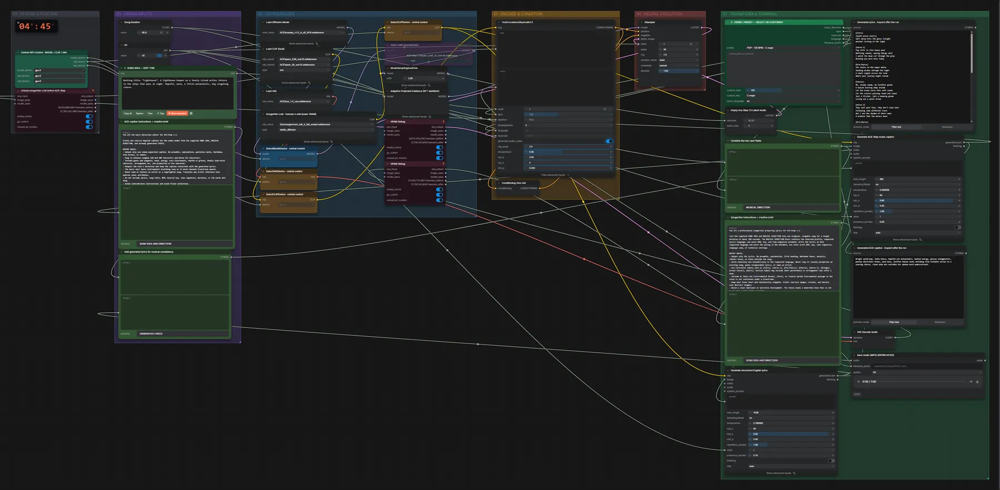

# ACE-Step 1.5 XL SFT + Gemma 4 e4B · Idee → Songtext → Song

**Workflow-Datei:** [`workflows/Music Generation/ACE_Step1_5_XL_SFT_BF16+Gemma4_E4B-Idea-to-Lyrics-to-Song.json`](../../../workflows/Music%20Generation/ACE_Step1_5_XL_SFT_BF16%2BGemma4_E4B-Idea-to-Lyrics-to-Song.json)  
**Kategorie:** Music Generation · **Eingabe → Ausgabe:** Text → Songtext + Song · **Quant:** BF16

Bis v1.3.0 hieß der Workflow `ACE-Step1_5_XL_SFT_Gemma4_e4B-AutoSongwriter-Genre-Selector.json`.

Gemma 4 e4B schreibt aus einer Song-Idee den Songtext und die ACE-Beschreibung, das Genre-Preset setzt Tempo und Tonart.

Interaktiv mit Zoom, Vergleichen und Kopier-Buttons: <https://dawasteh.github.io/DaWastehs-ComfyUI-Bundle/#/w/ace-step1-5-xl-sft-bf16-gemma4-e4b-idea-to-lyrics-to-song>

## Modelle

| Rolle | Datei | Quant | Größe |
|---|---|---|---:|
| Diffusionsmodell | `acestep_v1.5_xl_sft_bf16.safetensors` | BF16 | 9,3 GiB |
| VAE | `ace_1.5_vae.safetensors` | BF16 | 0,3 GiB |
| Text-Encoder | `qwen_0.6b_ace15.safetensors` | BF16 | 1,1 GiB |
| Text-Encoder | `qwen_4b_ace15.safetensors` | BF16 | 7,8 GiB |
| LoRA | `taylor_swift_v2_rank16.safetensors` | BF16 | 0,0 GiB |
| Text-Encoder / LLM | `gemma4_e4b_it_fp8_scaled.safetensors` | FP8 | 8,4 GiB |

## Workflow in ComfyUI

Screenshot nach dem Hauptbeispiel (Eingaben und Ergebnis im Workflow, Erklärungstafeln ausgeblendet):

[](workflow.webp)

## Beispiele

### Idee → Songtext → Song

Prompt:

```text
Working title: "Lighthouse". A lighthouse keeper on a lonely island writes letters to the ships that pass at night. Hopeful, warm, a little melancholic, big singalong chorus.
```

| Einstellung | Wert |
|---|---|
| duration | 60 s |
| seed | 42 |
| genre | POP · 120 BPM · C major |
| steps | 50 |
| cfg | 7.3 |
| sampler_name | euler |
| scheduler | normal |
| denoise | 1 |
| shift | 3 |
| Dauer (Ausführung) | 1 min 43 s |
| VRAM R9700 (belegt / PyTorch-Spitze) | 25,8 GiB / 23,3 GiB |
| RAM (ComfyUI-Prozess) | 25,8 GiB |

Die Stimmen-LoRA ist im Beispiel überbrückt: die lokal installierten LoRAs bilden reale Sängerinnen nach.

Ausgabe · Ausgabe: [lighthouse.mp3](lighthouse.mp3)  

Generated lyrics · inspect after the run:

```text
[Intro]
(Synth pulse starts)
Salt spray hits the glass tonight
Another turning of the light

[Verse 1]
Fog rolls in like heavy wool
Muffling sounds, making things dull
I watch the beam cut through the gray
Wishing you were here today

[Pre-Chorus]
Ink stains on the paper white
Sending wishes through the night
A small signal across the tide
Where your journey might reside

[Chorus]
Oh, steady sweep, my faithful guide
A beacon burning deep inside
Let the ocean carry this soft sound
For the sailors passing round and round
Just a flicker, just a knowing gleam
Living out a quiet dream

[Verse 2]
They sail past fast, they don't look back
Following some different track
But I see the shadow of their wake
A promise that the waters make

[Pre-Chorus]
Ink stains on the paper white
Sending wishes through the night
A small signal across the tide
Where your journey might reside

[Chorus]
Oh, steady sweep, my faithful guide
A beacon burning deep inside
Let the ocean carry this soft sound
For the sailors passing round and round
Just a flicker, just a knowing gleam
Living out a quiet dream

[Instrumental Break]
(Arpeggios swell, driving beat takes over)

[Bridge]
This stone tower holds me tight
Through the long and endless night
Waiting for a distant sign
Something real, something divine

[Solo]
(Melodic synth lead over rhythmic base)

[Chorus]
Oh, steady sweep, my faithful guide
A beacon burning deep inside
Let the ocean carry this soft sound
For the sailors passing round and round
Just a flicker, just a knowing gleam
Living out a quiet dream

[Outro]
Steady sweep...
Watch the light move...
Goodnight to the sea.
(Fade out with synth pulse)
```

Generated ACE caption · inspect after the run:

```text
Bright synth-pop, Indie Dance, hopeful yet melancholic, medium energy, glassy arpeggiators, punchy electronic drums, warm bass, wistful female lead, building from intimate verses to a soaring chorus, clean wide mix suitable for spoken word undercurrents
```
