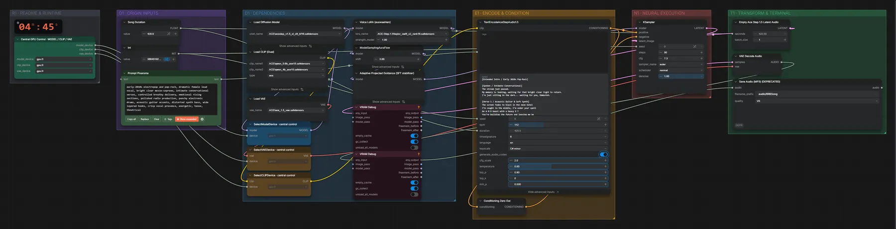

# ACE-Step 1.5 XL SFT (BF16) + LoRA · Song mit Stimmen-LoRA

**Workflow-Datei:** [`workflows/Music Generation/ACE_Step1_5_XL_SFT_BF16+LoRA-Tags+Lyrics-to-Song.json`](../../../workflows/Music%20Generation/ACE_Step1_5_XL_SFT_BF16%2BLoRA-Tags%2BLyrics-to-Song.json)  
**Kategorie:** Music Generation · **Eingabe → Ausgabe:** Tags + Songtext → Song · **Quant:** BF16

Bis v1.3.0 hieß der Workflow `ACE-Step1_5_XL-LoRA-Music-Generation.json`.

Wie ACE-Step XL SFT, dazu eine Stimmen- oder Stil-LoRA (eigene LoRAs aus dem Voice-LoRA-Training).

Interaktiv mit Zoom, Vergleichen und Kopier-Buttons: <https://dawasteh.github.io/DaWastehs-ComfyUI-Bundle/#/w/ace-step1-5-xl-sft-bf16-lora-tags-lyrics-to-song>

> Die lokal installierten ACE-Step-LoRAs bilden reale Sängerinnen nach; damit werden hier keine Beispiele erzeugt.

## Modelle

| Rolle | Datei | Quant | Größe |
|---|---|---|---:|
| Diffusionsmodell | `acestep_v1.5_xl_sft_bf16.safetensors` | BF16 | 9,3 GiB |
| VAE | `ace_1.5_vae.safetensors` | BF16 | 0,3 GiB |
| Text-Encoder | `qwen_0.6b_ace15.safetensors` | BF16 | 1,1 GiB |
| Text-Encoder | `qwen_4b_ace15.safetensors` | BF16 | 7,8 GiB |
| LoRA | `taylor_swift_v2_rank16.safetensors` | BF16 | 0,0 GiB |

## Workflow in ComfyUI

Screenshot nach dem Hauptbeispiel (Eingaben und Ergebnis im Workflow, Erklärungstafeln ausgeblendet):

