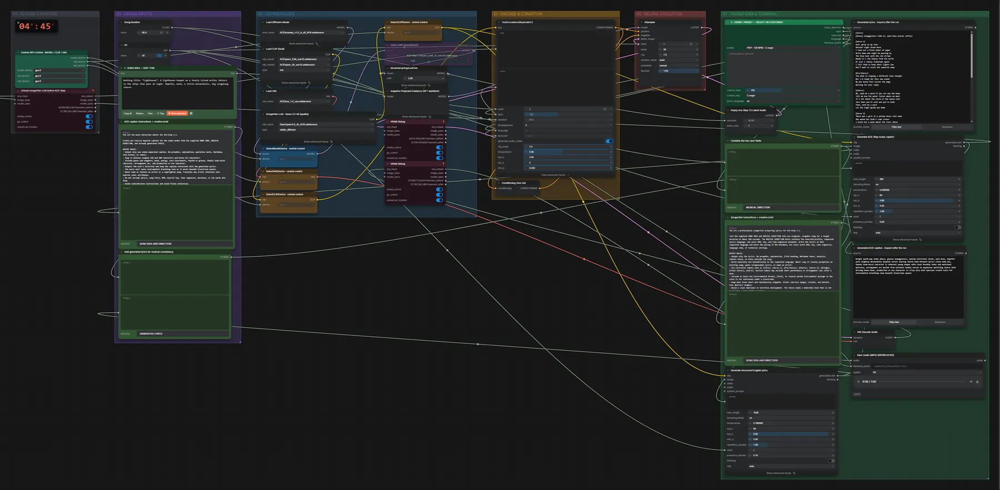

# ACE-Step 1.5 XL SFT + Qwen3.5 4B · Idee → Songtext → Song

**Workflow-Datei:** [`workflows/Music Generation/ACE_Step1_5_XL_SFT_BF16+Qwen3_5_4B-Idea-to-Lyrics-to-Song.json`](../../../workflows/Music%20Generation/ACE_Step1_5_XL_SFT_BF16%2BQwen3_5_4B-Idea-to-Lyrics-to-Song.json)  
**Kategorie:** Music Generation · **Eingabe → Ausgabe:** Text → Songtext + Song · **Quant:** BF16

Bis v1.3.0 hieß der Workflow `ACE-Step1_5_XL_SFT_Qwen3_5_4B-AutoSongwriter-Genre-Selector.json`.

Qwen3.5 4B schreibt aus einer Song-Idee den Songtext und die ACE-Beschreibung, das Genre-Preset setzt Tempo und Tonart.

Interaktiv mit Zoom, Vergleichen und Kopier-Buttons: <https://dawasteh.github.io/DaWastehs-ComfyUI-Bundle/#/w/ace-step1-5-xl-sft-bf16-qwen3-5-4b-idea-to-lyrics-to-song>

## Modelle

| Rolle | Datei | Quant | Größe |
|---|---|---|---:|
| Diffusionsmodell | `acestep_v1.5_xl_sft_bf16.safetensors` | BF16 | 9,3 GiB |
| VAE | `ace_1.5_vae.safetensors` | BF16 | 0,3 GiB |
| Text-Encoder | `qwen_0.6b_ace15.safetensors` | BF16 | 1,1 GiB |
| Text-Encoder | `qwen_4b_ace15.safetensors` | BF16 | 7,8 GiB |
| LoRA | `taylor_swift_v2_rank16.safetensors` | BF16 | 0,0 GiB |
| Text-Encoder / LLM | `qwen3.5_4b_bf16.safetensors` | BF16 | 8,7 GiB |

## Workflow in ComfyUI

Screenshot nach dem Hauptbeispiel (Eingaben und Ergebnis im Workflow, Erklärungstafeln ausgeblendet):

[](workflow.webp)

## Beispiele

### Idee → Songtext → Song

Prompt:

```text
Working title: "Lighthouse". A lighthouse keeper on a lonely island writes letters to the ships that pass at night. Hopeful, warm, a little melancholic, big singalong chorus.
```

| Einstellung | Wert |
|---|---|
| duration | 60 s |
| seed | 42 |
| genre | POP · 120 BPM · C major |
| steps | 50 |
| cfg | 7.3 |
| sampler_name | euler |
| scheduler | normal |
| denoise | 1 |
| shift | 3 |
| Dauer (Ausführung) | 1 min 28 s |
| VRAM R9700 (belegt / PyTorch-Spitze) | 26,4 GiB / 23,3 GiB |
| RAM (ComfyUI-Prozess) | 26,7 GiB |

Die Stimmen-LoRA ist im Beispiel überbrückt: die lokal installierten LoRAs bilden reale Sängerinnen nach.

Ausgabe · Ausgabe: [lighthouse.mp3](lighthouse.mp3)  

Generated lyrics · inspect after the run:

```text
[Intro]
[Glassy arpeggiators fade in, warm bass pulses softly]

[Verse 1]
Salt spray on my skin
Another night alone here
I take out a fresh sheet of paper
Write down who might be passing by
The blue boat with the red stripe
Maybe it's the family from the north
Or just a lonely fisherman again
I tell them to keep their lights low
Don't want to scare the seabirds away

[Pre-Chorus]
The wind is singing a different tune tonight
But I'm ready for this new sound
My pen moves fast across the page
Waiting for your reply

[Chorus]
Oh, send me a word if you can see the beam
Tell me how the water tastes where we meet
It's not about the storm or the heavy rain
Just that you're safe and you're home
Yeah, send me a word
Let the light guide you home

[Verse 2]
There was a girl in a yellow dress last week
She waved but didn't come closer
I wrote her a poem about the stars above
Said they're watching over the waves
Now I wonder if she read the words
Or if the tide took the ink along
But maybe she'll be back tomorrow
With a story to share too

[Bridge]
[Synth strings swell, drums get punchier]
Sometimes I feel so far away
From the world outside these walls
But every time the fog lifts high
A ship appears on the horizon line

[Instrumental Break]
[Soaring synth melody, playful dance beat kicks in hard]

[Chorus]
Oh, send me a word if you can see the beam
Tell me how the water tastes where we meet
It's not about the storm or the heavy rain
Just that you're safe and you're home
Yeah, send me a word
Let the light guide you home

[Outro]
[Music fades slowly, just bass and soft piano]
Keep the light burning bright
Even when the night gets long
We are all connected
By the same old song
```

Generated ACE caption · inspect after the run:

```text
Bright synth-pop indie dance, glassy arpeggiators, punchy electronic drums, warm bass, hopeful warm slightly melancholic playful verses soaring chorus hook-forward lyrics clean wide mix, female lead-vocal character is ethereal young keeper with clear breathy tones and emotional delivery, arrangement arc builds from intimate lonely verses to expansive uplifting chorus with driving dance beat, production or mix character is crisp airy with spacious reverb tails for instrumental breathing room beneath livestream speech
```
