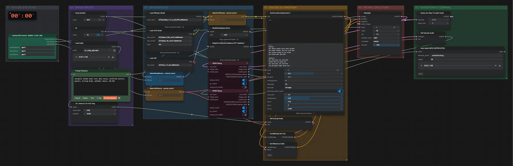

# ACE-Step 1.5 XL SFT (BF16) · Klangreferenz + Songtext → Song

**Workflow-Datei:** [`workflows/Music Generation/ACE_Step1_5_XL_SFT_BF16-Reference-Song+Lyrics-to-Song.json`](../../../workflows/Music%20Generation/ACE_Step1_5_XL_SFT_BF16-Reference-Song%2BLyrics-to-Song.json)  
**Kategorie:** Music Generation · **Eingabe → Ausgabe:** Audio + Tags + Songtext → Song · **Quant:** BF16

Bis v1.3.0 hieß der Workflow `ACE-Step1_5_XL_SFT_APG-Reference-Audio-Music-Generation.json`.

Eine 30-s-Referenz gibt Klangfarbe und Produktion vor, Tags und Songtext den neuen Song.

Interaktiv mit Zoom, Vergleichen und Kopier-Buttons: <https://dawasteh.github.io/DaWastehs-ComfyUI-Bundle/#/w/ace-step1-5-xl-sft-bf16-reference-song-lyrics-to-song>

## Modelle

| Rolle | Datei | Quant | Größe |
|---|---|---|---:|
| Diffusionsmodell | `acestep_v1.5_xl_sft_bf16.safetensors` | BF16 | 9,3 GiB |
| VAE | `ace_1.5_vae.safetensors` | BF16 | 0,3 GiB |
| Text-Encoder | `qwen_0.6b_ace15.safetensors` | BF16 | 1,1 GiB |
| Text-Encoder | `qwen_4b_ace15.safetensors` | BF16 | 7,8 GiB |

## Workflow in ComfyUI

Screenshot nach dem Hauptbeispiel (Eingaben und Ergebnis im Workflow, Erklärungstafeln ausgeblendet):

[](workflow.webp)

## Beispiele

### Neuer Song mit Klangreferenz

Prompt:

```text
energetic German indie rock, male vocals, distorted electric guitars, driving drums, anthemic chorus, 140 BPM
```

| Einstellung | Wert |
|---|---|
| lyrics | [Verse]
Wir fahren nachts durch leere Straßen
die Stadt schläft, doch wir sind wach
die Lichter ziehen an uns vorbei
wie Sterne über dem Dach

[Chorus]
Wir sind laut, wir sind hier
nichts hält uns heute auf
wir sind laut, wir sind hier
und die Nacht nimmt ihren Lauf

[Verse]
Ein altes Radio, ein kaputter Sitz
wir singen jedes Lied mit
der Morgen kommt, doch nicht so schnell
wir halten noch ein bisschen Schritt

[Chorus]
Wir sind laut, wir sind hier
nichts hält uns heute auf
wir sind laut, wir sind hier
und die Nacht nimmt ihren Lauf |
| duration | 60 s |
| seed | 42 |
| language | de |
| steps | 50 |
| cfg | 7.3 |
| sampler_name | euler |
| scheduler | normal |
| denoise | 1 |
| shift | 3 |
| Dauer (Ausführung) | 49 s |
| VRAM R9700 (belegt / PyTorch-Spitze) | 27,4 GiB / 24,4 GiB |
| RAM (ComfyUI-Prozess) | 19,9 GiB |

Klangreferenz ist der Pop-Song aus dem ACE-Step-Turbo-Beispiel.

Eingabe · ex_song_pop.mp3: [input_ex_song_pop.mp3](input_ex_song_pop.mp3)  
Ausgabe · Ausgabe: [rock-ref.mp3](rock-ref.mp3)
