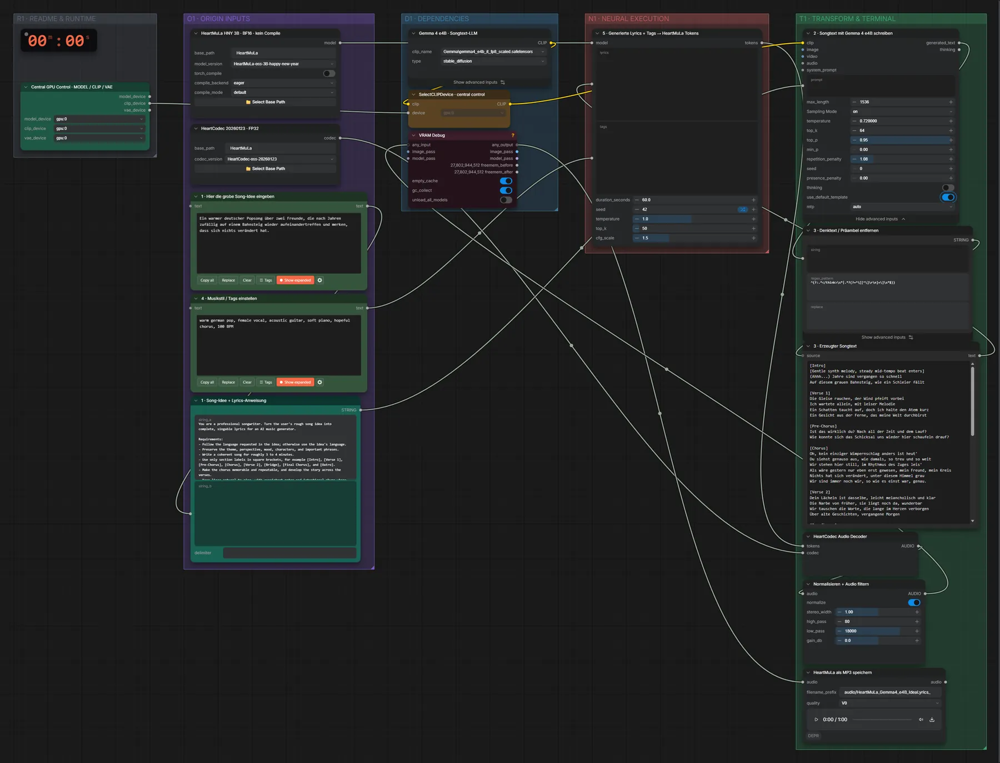

# HeartMuLa 3B + Gemma 4 e4B · Idee → Songtext → Song

**Workflow-Datei:** [`workflows/Music Generation/HeartMuLa_3B_HappyNewYear+Gemma4_E4B-Idea-to-Lyrics-to-Song.json`](../../../workflows/Music%20Generation/HeartMuLa_3B_HappyNewYear%2BGemma4_E4B-Idea-to-Lyrics-to-Song.json)  
**Kategorie:** Music Generation · **Eingabe → Ausgabe:** Text + Tags → Songtext + Song

Bis v1.3.0 hieß der Workflow `HeartMuLa_HappyNewYear_3B_Gemma4_e4B-Idea-to-Lyrics-to-Music.json`.

Gemma 4 e4B schreibt den Songtext (auch auf Deutsch), HeartMuLa 3B singt ihn mit HeartCodec.

Interaktiv mit Zoom, Vergleichen und Kopier-Buttons: <https://dawasteh.github.io/DaWastehs-ComfyUI-Bundle/#/w/heartmula-3b-happynewyear-gemma4-e4b-idea-to-lyrics-to-song>

## Modelle

| Rolle | Datei | Quant | Größe |
|---|---|---|---:|
| Text-Encoder / LLM | `gemma4_e4b_it_fp8_scaled.safetensors` | FP8 | 8,4 GiB |

## Workflow in ComfyUI

Screenshot nach dem Hauptbeispiel (Eingaben und Ergebnis im Workflow, Erklärungstafeln ausgeblendet):

[](workflow.webp)

## Beispiele

### Idee → Songtext → Song

Prompt:

```text
Ein warmer deutscher Popsong über zwei Freunde, die nach Jahren zufällig auf einem Bahnsteig wieder aufeinandertreffen und merken, dass sich nichts verändert hat.
```

| Einstellung | Wert |
|---|---|
| duration | 60 s |
| seed | 42 |
| Dauer (Ausführung) | 3 min 30 s |
| VRAM R9700 (belegt / PyTorch-Spitze) | 22,3 GiB / 17,8 GiB |
| RAM (ComfyUI-Prozess) | 29,7 GiB |

Ausgabe · HeartMuLa als MP3 speichern: [bahnsteig.mp3](bahnsteig.mp3)  

3 · Erzeugter Songtext:

```text
[Intro]
[Gentle synth melody, steady mid-tempo beat enters]
(Ahhh...) Jahre sind vergangen so schnell
Auf diesem grauen Bahnsteig, wie ein Schleier fällt

[Verse 1]
Die Gleise rauchen, der Wind pfeift vorbei
Ich wartete allein, mit leiser Melodie
Ein Schatten taucht auf, doch ich halte den Atem kurz
Ein Gesicht aus der Ferne, das meine Welt durchbirst

[Pre-Chorus]
Ist das wirklich du? Nach all der Zeit und dem Lauf?
Wie konnte sich das Schicksal uns wieder hier schaufeln drauf?

[Chorus]
Oh, kein einziger Wimpernschlag anders ist heut'
Du siehst genauso aus, wie damals, so treu und so weit
Wir stehen hier still, im Rhythmus des Zuges leis'
Als wäre gestern nur eben erst gewesen, mein Freund, mein Kreis
Nichts hat sich verändert, unter diesem Himmel grau
Wir sind immer noch wir, so wie es einst war, genau.

[Verse 2]
Dein Lächeln ist dasselbe, leicht melancholisch und klar
Die Narbe von früher, sie liegt noch da, wunderbar
Wir tauschen die Worte, die lange im Herzen verborgen
Über alte Geschichten, vergangene Morgen

[Pre-Chorus]
Die Sekunden verlangsamen sich, fast wie ein Filmband
In dieser Begegnung, wo die Zeit scheint zu stand

[Chorus]
Oh, kein einziger Wimpernschlag anders ist heut'
Du siehst genauso aus, wie damals, so treu und so weit
Wir stehen hier still, im Rhythmus des Zuges leis'
Als wäre gestern nur eben erst gewesen, mein Freund, mein Kreis
Nichts hat sich verändert, unter diesem Himmel grau
Wir sind immer noch wir, so wie es einst war, genau.

[Bridge]
Man sagt, das Leben formt uns, lässt die Kanten verändern
Doch bei dir, mein alter Freund, bleibt die Seele unverändert
Die Jugend ist fort, ja, doch der Kern ist geblieben rein
In diesem Moment am Bahnsteig, wo wir uns wiedersehn

[Instrumental Break]
[Melody swells slightly, reminiscent of nostalgic German pop arrangements]

[Chorus]
Oh, kein einziger Wimpernschlag anders ist heut'
Du siehst genauso aus, wie damals, so treu und so weit
Wir stehen hier still, im Rhythmus des Zuges leis'
Als wäre gestern nur eben erst gewesen, mein Freund, mein Kreis
Nichts hat sich verändert, unter diesem Himmel grau
Wir sind immer noch wir, so wie es einst war, genau.

[Outro]
Der Zug fährt langsam heran, ein tiefes, kehliges Geräusch
Wir winken uns zu, mit einem letzten sanften Gruß
Bis zum nächsten Mal... vielleicht irgendwo ganz fern.
(Musik klingt langsam aus mit einem warmen Synth Pad)
```
