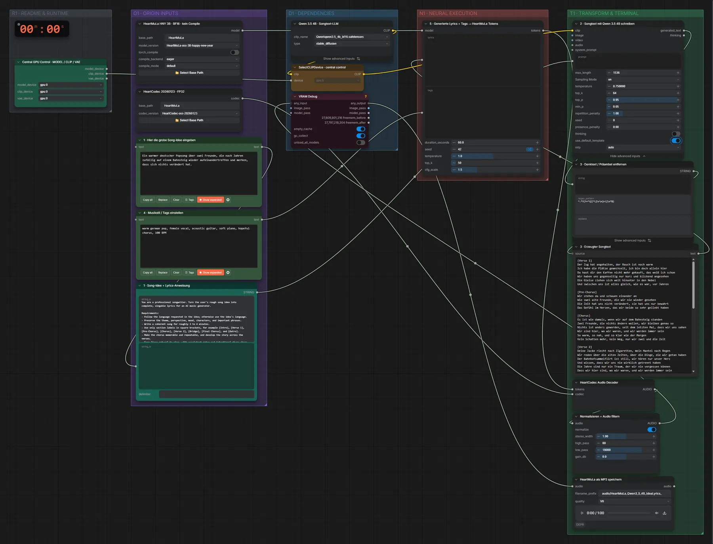

# HeartMuLa 3B + Qwen3.5 4B · Idee → Songtext → Song

**Workflow-Datei:** [`workflows/Music Generation/HeartMuLa_3B_HappyNewYear+Qwen3_5_4B-Idea-to-Lyrics-to-Song.json`](../../../workflows/Music%20Generation/HeartMuLa_3B_HappyNewYear%2BQwen3_5_4B-Idea-to-Lyrics-to-Song.json)  
**Kategorie:** Music Generation · **Eingabe → Ausgabe:** Text + Tags → Songtext + Song

Bis v1.3.0 hieß der Workflow `HeartMuLa_HappyNewYear_3B_Qwen3_5_4B-Idea-to-Lyrics-to-Music.json`.

Qwen3.5 4B schreibt den Songtext (auch auf Deutsch), HeartMuLa 3B singt ihn mit HeartCodec.

Interaktiv mit Zoom, Vergleichen und Kopier-Buttons: <https://dawasteh.github.io/DaWastehs-ComfyUI-Bundle/#/w/heartmula-3b-happynewyear-qwen3-5-4b-idea-to-lyrics-to-song>

## Modelle

| Rolle | Datei | Quant | Größe |
|---|---|---|---:|
| Text-Encoder / LLM | `qwen3.5_4b_bf16.safetensors` | BF16 | 8,7 GiB |

## Workflow in ComfyUI

Screenshot nach dem Hauptbeispiel (Eingaben und Ergebnis im Workflow, Erklärungstafeln ausgeblendet):

[](workflow.webp)

## Beispiele

### Idee → Songtext → Song

Prompt:

```text
Ein warmer deutscher Popsong über zwei Freunde, die nach Jahren zufällig auf einem Bahnsteig wieder aufeinandertreffen und merken, dass sich nichts verändert hat.
```

| Einstellung | Wert |
|---|---|
| duration | 60 s |
| seed | 42 |
| Dauer (Ausführung) | 3 min 4 s |
| VRAM R9700 (belegt / PyTorch-Spitze) | 22,8 GiB / 17,8 GiB |
| RAM (ComfyUI-Prozess) | 28,5 GiB |

Ausgabe · HeartMuLa als MP3 speichern: [bahnsteig.mp3](bahnsteig.mp3)  

3 · Erzeugter Songtext:

```text
[Verse 1]
Der Zug hat angehalten, der Rauch ist noch warm
Ich habe die Plätze gewechselt, ich bin doch allein hier
Du hast dir den Kaffee nicht mehr gekauft, das weiß ich schon
Wir haben uns gegenseitig nur kurz und blickend angesehen
Die Gleise ziehen sich weit hinunter in den Nebel
Und zwischen uns ist alles gleich, wie es war, vor Jahren

[Pre-Chorus]
Wir stehen da und schauen einander an
Wie zwei alte Freunde, die wir nie wieder gesehen
Die Zeit hat uns nicht verändert, sie hat uns nur bewahrt
Das Gefühl im Herzen, das wir beide so sehr geliebt haben

[Chorus]
Es ist wie damals, wenn wir auf dem Bahnsteig standen
Zwei Freunde, die nichts ändern wollen, wir bleiben genau so
Nichts ist anders geworden, seit dem letzten Mal, dass wir uns sahen
Wir sind hier, wo wir waren, und wir werden immer sein
So warm, so nah, und so klar wie der Morgen
Kein Schatten mehr, kein Weg, nur wir zwei und die Zeit

[Verse 2]
Deine Jacke riecht nach Zigaretten, mein Mantel nach Regen
Wir reden über die alten Zeiten, über die Dinge, die wir getan haben
Der Bahnhofsummelflirt ist still, wir hören nur unser Herz
Und wissen, dass wir uns nie wirklich getrennt haben
Die Jahre sind nur ein Traum, der wir nie vergessen können
Dass wir hier sind, wo wir waren, und wir werden immer sein

[Pre-Chorus]
Wir stehen da und schauen einander an
Wie zwei alte Freunde, die wir nie wieder gesehen
Die Zeit hat uns nicht verändert, sie hat uns nur bewahrt
Das Gefühl im Herzen, das wir beide so sehr geliebt haben

[Chorus]
Es ist wie damals, wenn wir auf dem Bahnsteig standen
Zwei Freunde, die nichts ändern wollen, wir bleiben genau so
Nichts ist anders geworden, seit dem letzten Mal, dass wir uns sahen
Wir sind hier, wo wir waren, und wir werden immer sein
So warm, so nah, und so klar wie der Morgen
Kein Schatten mehr, kein Weg, nur wir zwei und die Zeit

[Bridge]
Der Zug fährt ab, aber wir bleiben stehen
Wir wissen, dass wir nie gehen müssen, wir bleiben hier
In diesem Moment, in dieser Zeit, wo wir uns sehen
Wir sind immer noch die gleichen, wie wir damals waren
Und das ist das Schönste, was wir je erfahren haben

[Guitar Solo]
Ein warmer, sanfter Akkord, der die Melodie steigert, ohne zu brechen

[Final Chorus]
Es ist wie damals, wenn wir auf dem Bahnsteig standen
Zwei Freunde, die nichts ändern wollen, wir bleiben genau so
Nichts ist anders geworden, seit dem letzten Mal, dass wir uns sahen
Wir sind hier, wo wir waren, und wir werden immer sein
So warm, so nah, und so klar wie der Morgen
Kein Schatten mehr, kein Weg, nur wir zwei und die Zeit

[Outro]
Der Zug fährt ab, wir bleiben stehen
Wir wissen, dass wir nie gehen müssen, wir bleiben hier
Es ist wie damals, wenn wir auf dem Bahnsteig standen
Zwei Freunde, die nichts ändern wollen, wir bleiben genau so
```
