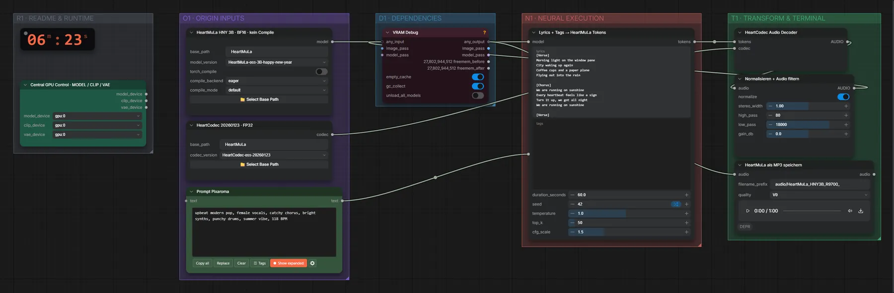

# HeartMuLa 3B · Tags + Songtext → Song

**Workflow-Datei:** [`workflows/Music Generation/HeartMuLa_3B_HappyNewYear-Tags+Lyrics-to-Song.json`](../../../workflows/Music%20Generation/HeartMuLa_3B_HappyNewYear-Tags%2BLyrics-to-Song.json)  
**Kategorie:** Music Generation · **Eingabe → Ausgabe:** Tags + Songtext → Song

Bis v1.3.0 hieß der Workflow `HeartMuLa_HappyNewYear_3B_R9700-Music-Generation.json`.

HeartMuLa (Happy-New-Year-Checkpoint) mit eigenem Songtext.

Interaktiv mit Zoom, Vergleichen und Kopier-Buttons: <https://dawasteh.github.io/DaWastehs-ComfyUI-Bundle/#/w/heartmula-3b-happynewyear-tags-lyrics-to-song>

## Workflow in ComfyUI

Screenshot nach dem Hauptbeispiel (Eingaben und Ergebnis im Workflow, Erklärungstafeln ausgeblendet):

[](workflow.webp)

## Beispiele

### Tags + Songtext → Song

Prompt:

```text
upbeat modern pop, female vocals, catchy chorus, bright synths, punchy drums, summer vibe, 118 BPM
```

| Einstellung | Wert |
|---|---|
| lyrics | [Verse]
Morning light on the window pane
City waking up again
Coffee cups and a paper plane
Flying out into the rain

[Chorus]
We are running on sunshine
Every heartbeat feels like a sign
Turn it up, we got all night
We are running on sunshine

[Verse]
Neon signs on a subway train
Every stranger knows my name
Dancing through the evening haze
We don't need to change a thing

[Chorus]
We are running on sunshine
Every heartbeat feels like a sign
Turn it up, we got all night
We are running on sunshine |
| duration | 60 s |
| seed | 42 |
| Dauer (Ausführung) | 2 min 33 s |
| VRAM R9700 (belegt / PyTorch-Spitze) | 22,0 GiB / 17,6 GiB |
| RAM (ComfyUI-Prozess) | 19,9 GiB |

Ausgabe · HeartMuLa als MP3 speichern: [pop.mp3](pop.mp3)
