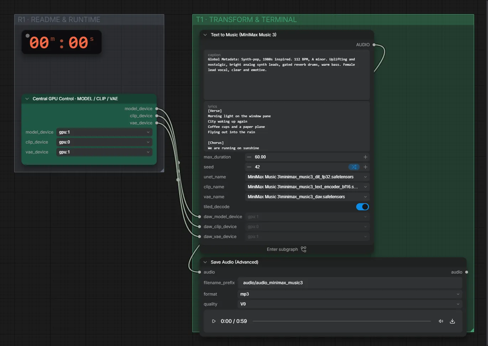

# MiniMax Music 3 (FP32) · Beschreibung + Songtext → Song

**Workflow-Datei:** [`workflows/Music Generation/MiniMax_Music3_FP32-Tags+Lyrics-to-Song.json`](../../../workflows/Music%20Generation/MiniMax_Music3_FP32-Tags%2BLyrics-to-Song.json)  
**Kategorie:** Music Generation · **Eingabe → Ausgabe:** Text + Songtext → Song · **Quant:** FP32

Bis v1.3.0 hieß der Workflow `MiniMax_Music3_FP32-BF16-Text-to-Music.json`.

Lokales MiniMax Music 3 mit strukturierter Beschreibung (Genre, Tempo, Tonart, Stimmung) und Songtext.

Interaktiv mit Zoom, Vergleichen und Kopier-Buttons: <https://dawasteh.github.io/DaWastehs-ComfyUI-Bundle/#/w/minimax-music3-fp32-tags-lyrics-to-song>

## Modelle

| Rolle | Datei | Quant | Größe |
|---|---|---|---:|
| Modell | `minimax_music3_dit_fp32.safetensors` | FP32 | 9,2 GiB |
| Modell | `minimax_music3_text_encoder_bf16.safetensors` | BF16 | 17,2 GiB |
| Modell | `minimax_music3_dav.safetensors` | FP32 | 0,2 GiB |

## Workflow in ComfyUI

Screenshot nach dem Hauptbeispiel (Eingaben und Ergebnis im Workflow, Erklärungstafeln ausgeblendet):

[](workflow.webp)

## Beispiele

### Beschreibung + Songtext → Song

Prompt:

```text
Global Metadata: Synth-pop, 1980s inspired. 112 BPM, A minor. Uplifting and nostalgic, bright analog synth leads, gated reverb drums, warm bass. Female lead vocal, clear and emotive.
```

| Einstellung | Wert |
|---|---|
| lyrics | [Verse]
Morning light on the window pane
City waking up again
Coffee cups and a paper plane
Flying out into the rain

[Chorus]
We are running on sunshine
Every heartbeat feels like a sign
Turn it up, we got all night
We are running on sunshine

[Verse]
Neon signs on a subway train
Every stranger knows my name
Dancing through the evening haze
We don't need to change a thing

[Chorus]
We are running on sunshine
Every heartbeat feels like a sign
Turn it up, we got all night
We are running on sunshine |
| duration | 60 s |
| seed | 42 |
| Dauer (Ausführung) | 2 min 46 s |
| VRAM R9700 (belegt / PyTorch-Spitze) | 25,7 GiB / 23,4 GiB |
| VRAM RX 9070 XT (belegt / PyTorch-Spitze) | 8,9 GiB / 8,7 GiB |
| RAM (ComfyUI-Prozess) | 19,7 GiB |

Ausgabe · Ausgabe: [synthpop.mp3](synthpop.mp3)
