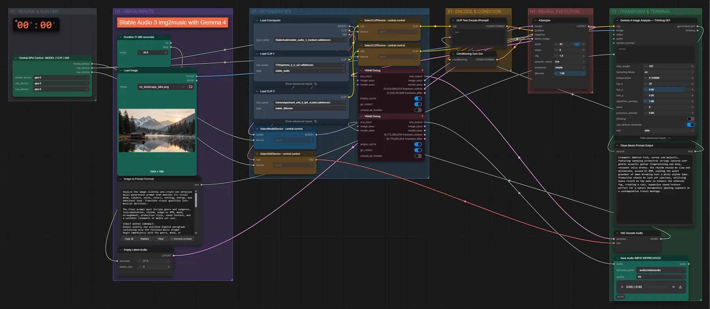

# Stable Audio 3 + Gemma 4 · Bild → Musik

**Workflow-Datei:** [`workflows/Music Generation/StableAudio3_Medium_FP32+Gemma4_E4B-Image-to-Music.json`](../../../workflows/Music%20Generation/StableAudio3_Medium_FP32%2BGemma4_E4B-Image-to-Music.json)  
**Kategorie:** Music Generation · **Eingabe → Ausgabe:** Bild → Prompt + Audio · **Quant:** FP32

Bis v1.3.0 hieß der Workflow `StableAudio3_Medium_Gemma4-Image-to-Music.json`.

Gemma 4 sieht das Bild und schreibt einen Musik-Prompt, Stable Audio 3 komponiert den passenden Soundtrack.

Interaktiv mit Zoom, Vergleichen und Kopier-Buttons: <https://dawasteh.github.io/DaWastehs-ComfyUI-Bundle/#/w/stableaudio3-medium-fp32-gemma4-e4b-image-to-music>

## Modelle

| Rolle | Datei | Quant | Größe |
|---|---|---|---:|
| Modell | `stable_audio_3_medium.safetensors` | FP32 | 8,6 GiB |
| Text-Encoder / LLM | `t5gemma_b_b_ul2.safetensors` | BF16 | 1,1 GiB |
| Text-Encoder / LLM | `gemma4_e4b_it_fp8_scaled.safetensors` | FP8 | 8,4 GiB |

## Workflow in ComfyUI

Screenshot nach dem Hauptbeispiel (Eingaben und Ergebnis im Workflow, Erklärungstafeln ausgeblendet):

[](workflow.webp)

## Beispiele

### Bild → passende Musik

| Einstellung | Wert |
|---|---|
| duration | 30 s |
| seed | 42 |
| steps | 8 |
| cfg | 1 |
| sampler_name | lcm |
| scheduler | simple |
| denoise | 1 |
| Dauer (Ausführung) | 23 s |
| VRAM R9700 (belegt / PyTorch-Spitze) | 17,7 GiB / 13,8 GiB |
| RAM (ComfyUI-Prozess) | 24,3 GiB |

Eingabe · ex_landscape_lake.png:  ([Datei](input_ex_landscape_lake.webp))  
Ausgabe · Ausgabe: [lake.mp3](lake.mp3)  

Clean Music Prompt Output:

```text
Cinematic Ambient Folk, serene and majestic, featuring sweeping orchestral strings layered over gentle acoustic guitar fingerpicking and deep, resonant cello drones. The rhythm should be slow and deliberate, around 65 BPM, evoking the quiet grandeur of dawn breaking over a misty alpine lake. Production should be lush yet spacious, utilizing heavy reverb on the pads to enhance the ethereal fog, creating a cool, expansive sound texture perfect for a nature documentary opening sequence or a contemplative travel montage.
```
