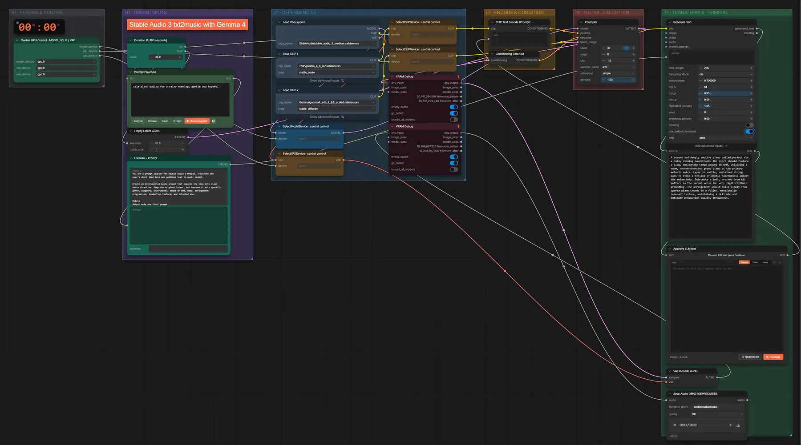

# Stable Audio 3 + Gemma 4 · Idee → Musik

**Workflow-Datei:** [`workflows/Music Generation/StableAudio3_Medium_FP32+Gemma4_E4B-Text-to-Music.json`](../../../workflows/Music%20Generation/StableAudio3_Medium_FP32%2BGemma4_E4B-Text-to-Music.json)  
**Kategorie:** Music Generation · **Eingabe → Ausgabe:** Text → Prompt + Audio · **Quant:** FP32

Bis v1.3.0 hieß der Workflow `StableAudio3_Medium_Gemma4-Text-to-Music.json`.

Gemma 4 erweitert die Idee zum Musik-Prompt (Pause zum Prüfen), Stable Audio 3 erzeugt die Musik.

Interaktiv mit Zoom, Vergleichen und Kopier-Buttons: <https://dawasteh.github.io/DaWastehs-ComfyUI-Bundle/#/w/stableaudio3-medium-fp32-gemma4-e4b-text-to-music>

## Modelle

| Rolle | Datei | Quant | Größe |
|---|---|---|---:|
| Modell | `stable_audio_3_medium.safetensors` | FP32 | 8,6 GiB |
| Text-Encoder / LLM | `t5gemma_b_b_ul2.safetensors` | BF16 | 1,1 GiB |
| Text-Encoder / LLM | `gemma4_e4b_it_fp8_scaled.safetensors` | FP8 | 8,4 GiB |

## Workflow in ComfyUI

Screenshot nach dem Hauptbeispiel (Eingaben und Ergebnis im Workflow, Erklärungstafeln ausgeblendet):

[](workflow.webp)

## Beispiele

### Idee → Musik

Prompt:

```text
calm piano ballad for a rainy evening, gentle and hopeful
```

| Einstellung | Wert |
|---|---|
| duration | 30 s |
| seed | 42 |
| steps | 8 |
| cfg | 1 |
| sampler_name | lcm |
| scheduler | simple |
| denoise | 1 |
| Dauer (Ausführung) | 16 s |
| VRAM R9700 (belegt / PyTorch-Spitze) | 16,0 GiB / 13,8 GiB |
| RAM (ComfyUI-Prozess) | 24,0 GiB |

Gemma schreibt den Musik-Prompt; er wird am Pause-Knoten unverändert übernommen („Continue“).

Ausgabe · Ausgabe: [piano.mp3](piano.mp3)  

PixaromaShowText:

```text
A serene and deeply emotive piano ballad perfect for a rainy evening soundtrack. The piece should feature a slow, deliberate tempo around 68 BPM, utilizing a warm, reverb-drenched grand piano as the primary melodic voice. Layer in subtle, sustained string pads to evoke a feeling of gentle hopefulness amidst the melancholy. Introduce a soft, brushed drum kit pattern in the second verse for very light rhythmic grounding. The arrangement should build slowly from sparse piano chords to a fuller, emotionally resonant texture, maintaining a delicate and intimate production quality throughout.
```
