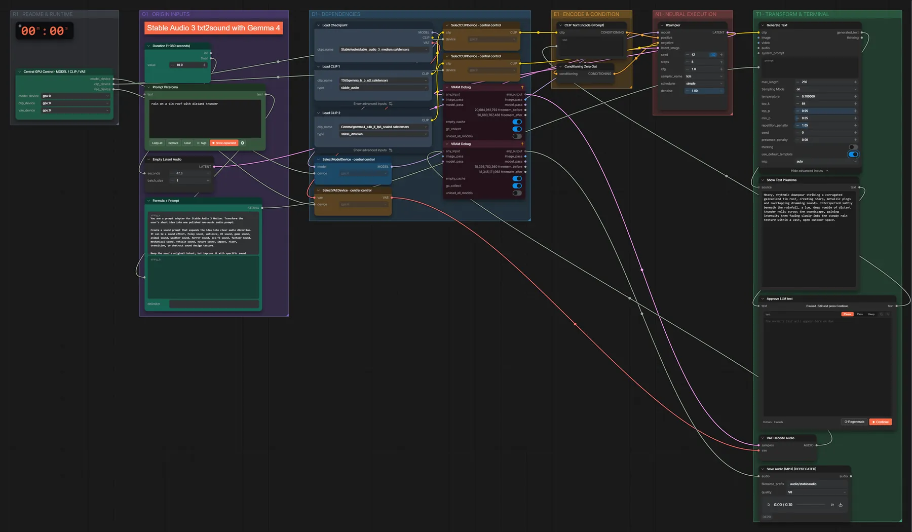

# Stable Audio 3 + Gemma 4 · Idee → Geräusch

**Workflow-Datei:** [`workflows/Music Generation/StableAudio3_Medium_FP32+Gemma4_E4B-Text-to-Sound.json`](../../../workflows/Music%20Generation/StableAudio3_Medium_FP32%2BGemma4_E4B-Text-to-Sound.json)  
**Kategorie:** Music Generation · **Eingabe → Ausgabe:** Text → Prompt + Audio · **Quant:** FP32

Bis v1.3.0 hieß der Workflow `StableAudio3_Medium_Gemma4-Text-to-Sound.json`.

Wie Idee → Musik, abgestimmt auf Geräusche und Atmosphären.

Interaktiv mit Zoom, Vergleichen und Kopier-Buttons: <https://dawasteh.github.io/DaWastehs-ComfyUI-Bundle/#/w/stableaudio3-medium-fp32-gemma4-e4b-text-to-sound>

## Modelle

| Rolle | Datei | Quant | Größe |
|---|---|---|---:|
| Modell | `stable_audio_3_medium.safetensors` | FP32 | 8,6 GiB |
| Text-Encoder / LLM | `t5gemma_b_b_ul2.safetensors` | BF16 | 1,1 GiB |
| Text-Encoder / LLM | `gemma4_e4b_it_fp8_scaled.safetensors` | FP8 | 8,4 GiB |

## Workflow in ComfyUI

Screenshot nach dem Hauptbeispiel (Eingaben und Ergebnis im Workflow, Erklärungstafeln ausgeblendet):

[](workflow.webp)

## Beispiele

### Idee → Geräusch

Prompt:

```text
rain on a tin roof with distant thunder
```

| Einstellung | Wert |
|---|---|
| duration | 10 s |
| seed | 42 |
| steps | 8 |
| cfg | 1 |
| sampler_name | lcm |
| scheduler | simple |
| denoise | 1 |
| Dauer (Ausführung) | 13 s |
| VRAM R9700 (belegt / PyTorch-Spitze) | 15,3 GiB / 13,4 GiB |
| RAM (ComfyUI-Prozess) | 24,1 GiB |

Gemma schreibt den Geräusch-Prompt; er wird am Pause-Knoten unverändert übernommen („Continue“).

Ausgabe · Ausgabe: [rain.mp3](rain.mp3)  

PixaromaShowText:

```text
Heavy, rhythmic downpour striking a corrugated galvanized tin roof, creating sharp, metallic pings and overlapping drumming sounds. Interspersed subtly beneath the rainfall, a low, deep rumble of distant thunder rolls across the soundscape, gaining intensity then fading slowly into the steady rain texture within a vast, open outdoor space.
```

### Idee → Geräusch

Prompt:

```text
footsteps on crunchy snow in a quiet forest
```

| Einstellung | Wert |
|---|---|
| duration | 10 s |
| seed | 43 |
| steps | 8 |
| cfg | 1 |
| sampler_name | lcm |
| scheduler | simple |
| denoise | 1 |
| Dauer (Ausführung) | 5 s |
| VRAM R9700 (belegt / PyTorch-Spitze) | 16,7 GiB / 14,6 GiB |
| RAM (ComfyUI-Prozess) | 11,1 GiB |

Ausgabe · Ausgabe: [footsteps.mp3](footsteps.mp3)  

PixaromaShowText:

```text
Heavy, slow bootfalls crunching deeply through thick, powdery snow, captured close to the ground with crisp, high-frequency detail. The soundscape is dominated by the satisfying, brittle fracturing of frozen crystals under weight, set within a vast, cold, and isolated pine forest ambience with minimal wind. Each step has a pronounced, decaying crackle.
```
