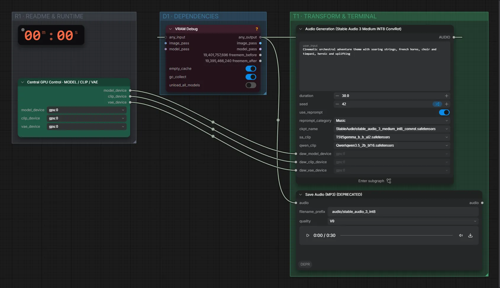

# Stable Audio 3 Medium (INT8) · Text → Musik/Geräusch

**Workflow-Datei:** [`workflows/Music Generation/StableAudio3_Medium_INT8+Qwen3_5_2B-Text-to-Audio.json`](../../../workflows/Music%20Generation/StableAudio3_Medium_INT8%2BQwen3_5_2B-Text-to-Audio.json)  
**Kategorie:** Music Generation · **Eingabe → Ausgabe:** Text → Audio · **Quant:** INT8

Bis v1.3.0 hieß der Workflow `StableAudio3_Medium_INT8_ConvRot-Audio-Generation.json`.

INT8-Variante – im Quant-Vergleich neben FP32.

Interaktiv mit Zoom, Vergleichen und Kopier-Buttons: <https://dawasteh.github.io/DaWastehs-ComfyUI-Bundle/#/w/stableaudio3-medium-int8-qwen3-5-2b-text-to-audio>

## Modelle

| Rolle | Datei | Quant | Größe |
|---|---|---|---:|
| Text-Encoder / LLM | `qwen3.5_2b_bf16.safetensors` | BF16 | 4,2 GiB |
| Modell | `stable_audio_3_medium_int8_convrot.safetensors` | INT8 | 4,6 GiB |
| Text-Encoder / LLM | `t5gemma_b_b_ul2.safetensors` | BF16 | 1,1 GiB |

## Workflow in ComfyUI

Screenshot nach dem Hauptbeispiel (Eingaben und Ergebnis im Workflow, Erklärungstafeln ausgeblendet):

[](workflow.webp)

## Beispiele

### Musik · Orchester

Prompt:

```text
Cinematic orchestral adventure theme with soaring strings, french horns, choir and timpani, heroic and uplifting
```

| Einstellung | Wert |
|---|---|
| duration | 30 s |
| seed | 42 |
| category | Music |
| Dauer (Ausführung) | 12 s |
| VRAM R9700 (belegt / PyTorch-Spitze) | 17,9 GiB / 13,1 GiB |
| VRAM RX 9070 XT (belegt / PyTorch-Spitze) | 2,8 GiB / 0,1 GiB |
| RAM (ComfyUI-Prozess) | 10,8 GiB |

Qwen3.5 2B formuliert die Beschreibung vorher aus (Reprompt, Standard im Workflow).

Ausgabe · Ausgabe: [orchestra.mp3](orchestra.mp3)  

PreviewAny:

```text
30
```

### Geräusch · Regen

Prompt:

```text
Heavy rain on a tin roof with distant rolling thunder and water dripping from a gutter
```

| Einstellung | Wert |
|---|---|
| duration | 15 s |
| seed | 42 |
| category | SFX |
| Dauer (Ausführung) | 2 s |
| VRAM R9700 (belegt / PyTorch-Spitze) | 18,1 GiB / 12,9 GiB |
| VRAM RX 9070 XT (belegt / PyTorch-Spitze) | 2,8 GiB / 0,1 GiB |
| RAM (ComfyUI-Prozess) | 1,9 GiB |

Ausgabe · Ausgabe: [rain.mp3](rain.mp3)  

PreviewAny:

```text
15
```
