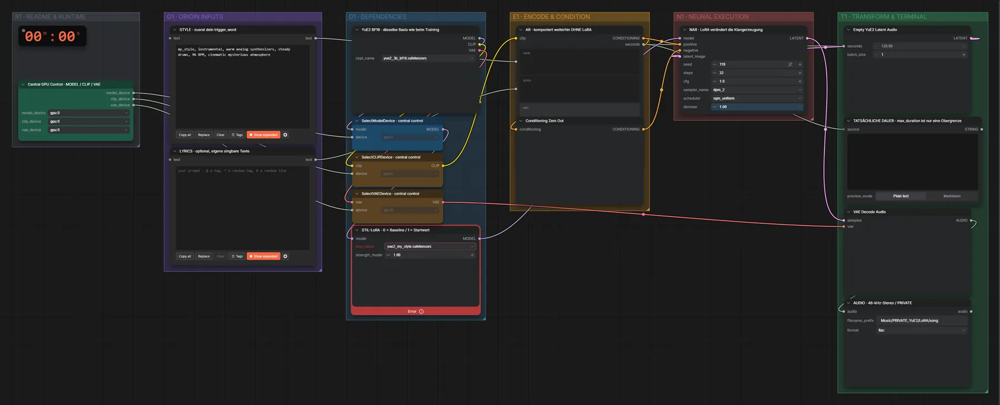

# YuE2 3B (BF16) + Stil-LoRA · Song (privat)

**Workflow-Datei:** [`workflows/Music Generation/YuE2_3B_BF16+LoRA-PRIVATE-Tags+Lyrics-to-Song.json`](../../../workflows/Music%20Generation/YuE2_3B_BF16%2BLoRA-PRIVATE-Tags%2BLyrics-to-Song.json)  
**Kategorie:** Music Generation · **Eingabe → Ausgabe:** Tags + Songtext → Song · **Quant:** BF16

Bis v1.3.0 hieß der Workflow `YuE2_3B_BF16-PRIVATE-LoRA-Music-Generation.json`.

YuE2 mit eigener Stil-LoRA (aus dem YuE2-LoRA-Training).

Interaktiv mit Zoom, Vergleichen und Kopier-Buttons: <https://dawasteh.github.io/DaWastehs-ComfyUI-Bundle/#/w/yue2-3b-bf16-lora-private-tags-lyrics-to-song>

> YuE2 steht unter CC-BY-NC-4.0 und ist im Bundle ausdrücklich für private Projekte gedacht – deshalb keine Audiobeispiele im öffentlichen Repo.

## Modelle

| Rolle | Datei | Quant | Größe |
|---|---|---|---:|
| Modell | `yue2_3b_bf16.safetensors` | BF16 | 7,3 GiB |
| LoRA | `yue2_my_style.safetensors` | – | – |

## Workflow in ComfyUI

Screenshot nach dem Hauptbeispiel (Eingaben und Ergebnis im Workflow, Erklärungstafeln ausgeblendet):

