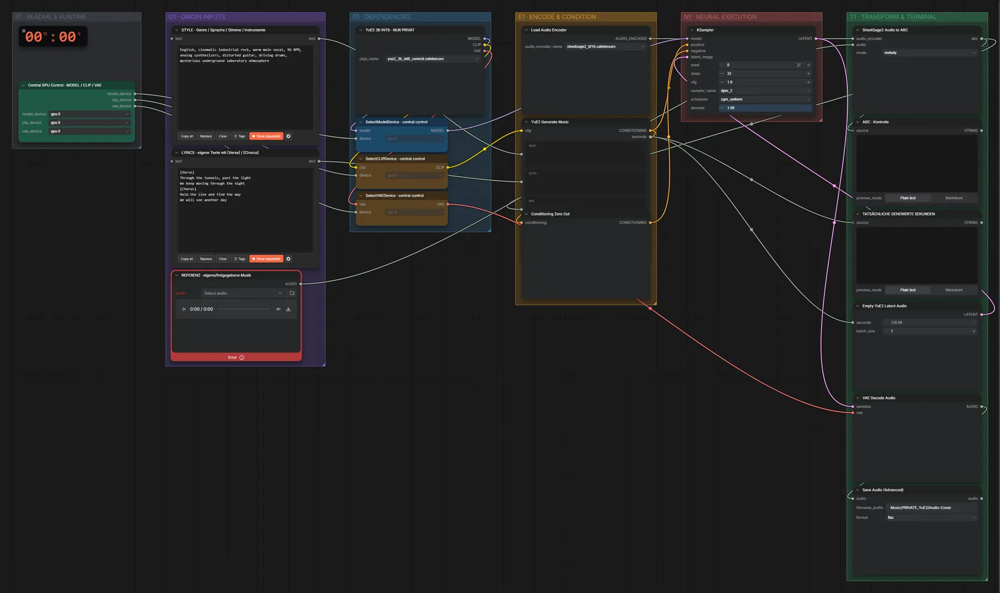

# YuE2 3B (INT8) · Song + Songtext → Cover (privat)

**Workflow-Datei:** [`workflows/Music Generation/YuE2_3B_INT8-PRIVATE-Song+Lyrics-to-Cover-Song.json`](../../../workflows/Music%20Generation/YuE2_3B_INT8-PRIVATE-Song%2BLyrics-to-Cover-Song.json)  
**Kategorie:** Music Generation · **Eingabe → Ausgabe:** Song + Songtext → Song · **Quant:** INT8

Bis v1.3.0 hieß der Workflow `YuE2_3B_INT8-PRIVATE-Audio-Cover.json`.

Neue Version eines eigenen Songs mit anderem Text.

Interaktiv mit Zoom, Vergleichen und Kopier-Buttons: <https://dawasteh.github.io/DaWastehs-ComfyUI-Bundle/#/w/yue2-3b-int8-private-song-lyrics-to-cover-song>

> YuE2 steht unter CC-BY-NC-4.0 und ist im Bundle ausdrücklich für private Projekte gedacht – deshalb keine Audiobeispiele im öffentlichen Repo.

## Modelle

| Rolle | Datei | Quant | Größe |
|---|---|---|---:|
| Modell | `yue2_3b_int8_convrot.safetensors` | INT8 | 3,7 GiB |
| Audio-Encoder | `sheetsage2_bf16.safetensors` | BF16 | 1,3 GiB |

## Workflow in ComfyUI

Screenshot nach dem Hauptbeispiel (Eingaben und Ergebnis im Workflow, Erklärungstafeln ausgeblendet):

