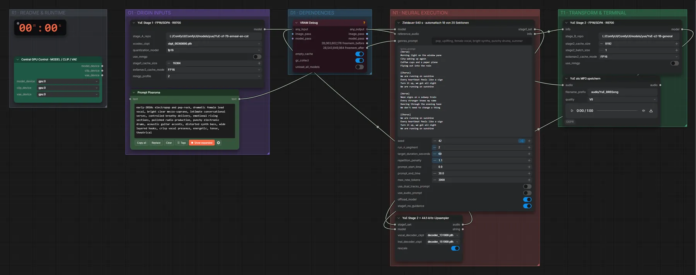

# YuE 7B (FP16) · Genre-Tags + Songtext → Song

**Workflow-Datei:** [`workflows/Music Generation/YuE_7B_FP16-Tags+Lyrics-to-Song.json`](../../../workflows/Music%20Generation/YuE_7B_FP16-Tags%2BLyrics-to-Song.json)  
**Kategorie:** Music Generation · **Eingabe → Ausgabe:** Tags + Songtext → Song · **Quant:** FP16

Bis v1.3.0 hieß der Workflow `YuE_7B-FP16_R9700-Music-Generation.json`.

YuE (Stage A 7B + Stage B 1B) singt Songtexte abschnittsweise; langsam, aber sehr musikalisch.

Interaktiv mit Zoom, Vergleichen und Kopier-Buttons: <https://dawasteh.github.io/DaWastehs-ComfyUI-Bundle/#/w/yue-7b-fp16-tags-lyrics-to-song>

## Modelle

| Rolle | Datei | Quant | Größe |
|---|---|---|---:|
| Modell | `ckpt_00360000.pth` | – | 1,3 GiB |
| Modell | `decoder_131000.pth` | – | 0,1 GiB |
| Modell | `decoder_151000.pth` | – | 0,1 GiB |

## Workflow in ComfyUI

Screenshot nach dem Hauptbeispiel (Eingaben und Ergebnis im Workflow, Erklärungstafeln ausgeblendet):

[](workflow.webp)

## Beispiele

### Genre-Tags + Songtext → Song

Prompt:

```text
pop, uplifting, female vocal, bright synths, punchy drums, summer
```

| Einstellung | Wert |
|---|---|
| lyrics | [Verse]
Morning light on the window pane
City waking up again
Coffee cups and a paper plane
Flying out into the rain

[Chorus]
We are running on sunshine
Every heartbeat feels like a sign
Turn it up, we got all night
We are running on sunshine

[Verse]
Neon signs on a subway train
Every stranger knows my name
Dancing through the evening haze
We don't need to change a thing

[Chorus]
We are running on sunshine
Every heartbeat feels like a sign
Turn it up, we got all night
We are running on sunshine |
| duration | 2 Abschnitt(e) (~60 s) |
| seed | 42 |
| Dauer (Ausführung) | 25 min 24 s |
| VRAM R9700 (belegt / PyTorch-Spitze) | 15,3 GiB / 12,9 GiB |
| RAM (ComfyUI-Prozess) | 17,9 GiB |

2 Liedabschnitt(e), ~60 s statt der voreingestellten 540-s-Zieldauer.

Ausgabe · YuE als MP3 speichern: [pop.mp3](pop.mp3)
